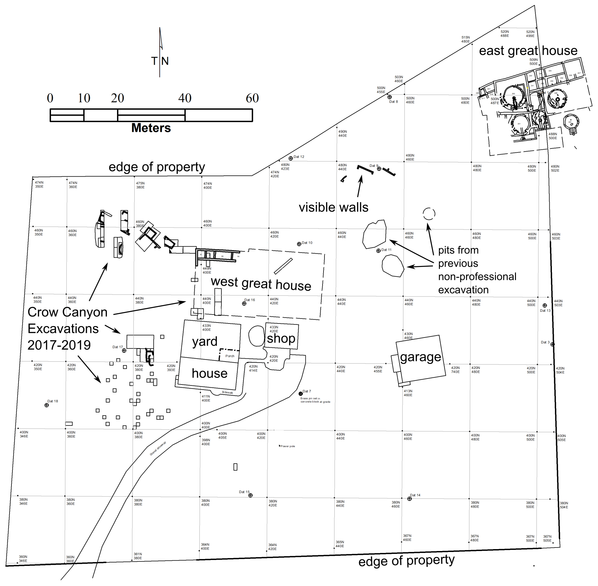
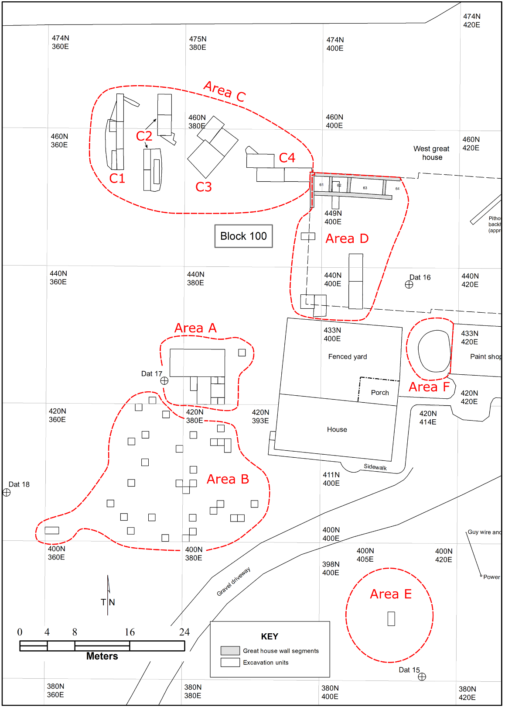

{width="1.4in"
height="0.5in"}{width="1.6479997812773404in"
height="0.4in"}

© Copyright 2019 by [Crow Canyon Archaeological
Center](http://www.crowcanyon.org/)

All rights reserved

[To borrow, cite, or request permission](#how-to-cite-this-publication)

REMINDER: Archaeological resources are protected by federal laws, and
archaeological research is guided by a set of professional ethics. See
[Archaeological Ethics and
Law](http://www.crowcanyon.org/index.php/archaeological-ethics-law).[]{#_Toc28268329
.anchor}

Table of Contents
=================

[Table of Contents 2](#_Toc28268329)

[List of Figures 4](#list-of-figures)

[List of Tables 4](#list-of-tables)

[Introduction 5](#introduction)

[The Northern Chaco Outliers Project
5](#the-northern-chaco-outliers-project)

[Project Area Location and Ownership
6](#project-area-location-and-ownership)

[Environmental Setting 7](#_Toc28268335)

[Previous Archaeological Investigation at the Lakeview Group
7](#_Toc28268336)

[Permits and Permissions 8](#permits-and-permissions)

[The 2019 Annual Report 8](#the-2019-annual-report)

[Excavations at the Haynie Site 9](#_Toc28268339)

[The Crow Canyon Excavation, Documentation, and Recording System
9](#the-crow-canyon-excavation-documentation-and-recording-system)

[Area A 10](#area-a)

[Arbitrary 179 11](#arbitrary-179)

[Arbitrary 176 11](#arbitrary-176)

[Arbitrary 1029 11](#arbitrary-1029)

[Structure 1047 11](#structure-1047)

[Area B 12](#area-b)

[Arbitrary 170, 195, 1001 12](#arbitrary-170-195-1001)

[Arbitrary 179 and 1021 12](#arbitrary-179-and-1021)

[Nonstructure 1040 12](#nonstructure-1040)

[Arbitrary 181, 1009 13](#arbitrary-181-1009)

[Nonstructure 1038 13](#nonstructure-1038)

[Arbitrary 182 13](#arbitrary-182)

[Area C 13](#area-c)

[Excavations in Area C1 13](#excavations-in-area-c1)

[Nonstructure 192 14](#nonstructure-192)

[Structure 1003 14](#structure-1003)

[Structure 1010 15](#structure-1010)

[Excavations in Area C2 15](#excavations-in-area-c2)

[Structure 1018 16](#structure-1018)

[Nonstructure 1017 16](#nonstructure-1017)

[Structure 1036 17](#structure-1036)

[Arbitrary 1011 17](#arbitrary-1011)

[Structure 1002 17](#structure-1002)

[Arbitrary 171, 1023 18](#arbitrary-171-1023)

[Nonstructure 1048 18](#nonstructure-1048)

[Structure 1052 18](#structure-1052)

[Structure 1026 19](#structure-1026)

[Nonstructure 1035 19](#nonstructure-1035)

[Structure 1042 19](#structure-1042)

[Excavations in Area C4 20](#excavations-in-area-c4)

[Arbitrary 184, 174, 1033 20](#arbitrary-184-174-1033)

[Nonstructure 1054 21](#nonstructure-1054)

[Nonstructure 1055 21](#nonstructure-1055)

[Nonstructure 1056 21](#nonstructure-1056)

[Nonstructure 1057 21](#nonstructure-1057)

[Nonstructure 196 21](#nonstructure-196)

[Nonstructure 1058 22](#nonstructure-1058)

[Structure 1016 22](#structure-1016)

[Nonstructure 1015 22](#nonstructure-1015)

[Nonstructure 1020 22](#nonstructure-1020)

[Arbitrary 1032 23](#arbitrary-1032)

[Nonstructure 1060 23](#nonstructure-1060)

[Nonstructure 1031 23](#nonstructure-1031)

[Nonstructure 1027 23](#nonstructure-1027)

[Nonstructure 1043 24](#nonstructure-1043)

[Nonstructure 1044 24](#nonstructure-1044)

[Nonstructure 1050 24](#nonstructure-1050)

[Structure 1051 24](#structure-1051)

[Nonstructure 1059 25](#nonstructure-1059)

[Arbitrary 1061 25](#arbitrary-1061)

[Area D 25](#area-d)

[Arbitrary 183 25](#arbitrary-183)

[Arbitrary 194 26](#arbitrary-194)

[Structure 1024 26](#structure-1024)

[Area E 26](#area-e)

[Arbitrary 195 27](#arbitrary-195)

[Arbitrary 1022 27](#arbitrary-1022)

[Area F 27](#area-f)

[Arbitrary 1019 27](#arbitrary-1019)

[Paleohydrology Fieldwork 27](#paleohydrology-fieldwork)

[Artifact Analysis 28](#artifact-analysis)

[In-House Artifact Cataloging and Analyses
28](#in-house-artifact-cataloging-and-analyses)

[Chronometric Sample Analysis 29](#chronometric-sample-analysis)

[Perishables Analyses 29](#perishables-analyses)

[Human Remains and Osteological Analysis
30](#human-remains-and-osteological-analysis)

[Curation 30](#_Toc28268406)

[Research and Outreach 30](#_Toc28268407)

[Research Presentations 30](#research-presentations)

[Public Involvement and Outreach 30](#public-involvement-and-outreach)

[College Field School and Internship Program
31](#college-field-school-and-internship-program)

[Native American Involvement 31](#native-american-involvement)

[Summary of 2019 Season and Work Plan for 2020
32](#summary-of-2019-season-and-work-plan-for-2020)

[References Cited 50](#references-cited)

[Appendix A -- Personnel 55](#_Toc28268414)

[Permanent Crow Canyon Field and Laboratory Staff
56](#permanent-crow-canyon-field-and-laboratory-staff)

[Seasonal Staff 56](#seasonal-staff)

[IT Support Staff 56](#it-support-staff)

[Cultural Explorations Staff 56](#cultural-explorations-staff)

[Crow Canyon 2019 Interns 56](#crow-canyon-2019-interns)

[To Borrow, Cite, or Request Permission
57](#to-borrow-cite-or-request-permission)

[To Borrow from this Publication 57](#to-borrow-from-this-publication)

[How to Cite this Publication 57](#how-to-cite-this-publication)

[How to Request Permission to Borrow
57](#how-to-request-permission-to-borrow)

List of Figures
===============

[Figure 1. Map showing location of Haynie site, Ida Jean site, Wallace
Ruin, and other Chaco--period great houses within southwestern
Colorado.\_\_\_\_\_\_\_\_\_\_\_\_\_\_\_\_\_\_\_\_\_\_\_\_\_\_\_\_\_\_\_\_\_\_\_35](#_Ref27638545)

[Figure 2. Map showing the East and West Great Houses at the Haynie
site.\_\_\_\_\_\_\_\_\_\_\_\_\_\_\_\_ 36](#_Ref27638910)

[Figure 3. Google Earth satellite image showing landscape of the
Lakeview Group.\_\_\_\_\_\_\_\_\_\_ 37](#_Ref28260902)

[Figure 4. Map showing the location of Excavation Areas in Block 100 of
the Haynie site.\_\_\_\_ 38](#_Ref27572107)

[Figure 5. Map showing location of segments in Architectural Block 100
of the Haynie site.\_\_\_ 39](#_Ref27573303)

[Figure 6. Location of numbered structures in Architectural Block 100 of
the Haynie site.\_\_\_\_\_ 40](#_Ref27575018)

[Figure 7. Photo showing wall segment or structure corner beneath floor
of Structure 1010.\_\_\_ 41](#_Toc29378645)

[Figure 8. Artifacts on the floor (SR00-01) in the north half of
Structure 1042.\_\_\_\_\_\_\_\_\_\_\_\_\_\_ 41](#_Ref27639721)

[Figure 9. In progress excavation photo showing Structure 1016 wall
alignment.\_\_\_\_\_\_\_\_\_\_\_\_ 42](#_Ref27642823)

[Figure 10. Burned roof beam and well-preserved roofing material from
Structure 1024.\_\_\_\_\_\_ 42](#_Ref27643014)

[Figure 11. Final excavation photo of the floor surface in Structure
1024.\_\_\_\_\_\_\_\_\_\_\_\_\_\_\_\_\_\_ 43](#_Ref27639986)

[Figure 12. Photo showing extent of burned bulrush/cattail open-twined
mat\_\_\_\_\_\_\_\_\_\_\_\_\_\_\_ 43](#_Ref27637103)

[Figure 13. Detail of burned open-twined
mat.\_\_\_\_\_\_\_\_\_\_\_\_\_\_\_\_\_\_\_\_\_\_\_\_\_\_\_\_\_\_\_\_\_\_\_\_\_\_\_
44](#_Ref27637326)

[Figure 14. Lower end of mat, warp ends shown
vertically.\_\_\_\_\_\_\_\_\_\_\_\_\_\_\_\_\_\_\_\_\_\_\_\_\_\_\_\_\_
44](#_Ref27637502)

List of Tables
==============

[Table 1. List of Excavation Units in Architectural Block 100 of the
Haynie site.\_\_\_\_\_\_\_\_\_\_\_ 45](#_Ref27572115)

[Table 2. Descriptions and locations of Study Units used during the 2019
field season.\_\_\_\_\_\_\_ 46](#_Ref27660356)

[Table 3. Radiocarbon dates obtained in 2019 from Architectural Block
100 of the Haynie site. 48](#_Ref27575671)

[Table 4. List of public presentations involving the
NCOP.\_\_\_\_\_\_\_\_\_\_\_\_\_\_\_\_\_\_\_\_\_\_\_\_\_\_\_\_\_
49](#_Ref27638054)

 Introduction
============

In the summer of 2016, the Crow Canyon Archaeological Center (Crow
Canyon) initiated the Northern Chaco Outliers Project (NCOP), a
multi-year excavation and laboratory analysis project focused on the
Lakeview Group in southwestern Colorado. This report describes the
project background and research objectives and summarizes excavation,
analyses, and outreach conducted by Crow Canyon during the 2019 field
season.

The Northern Chaco Outliers Project
-----------------------------------

Chacoan society flourished between A.D. 840 and 1140 and was centered in
Chaco Canyon, New Mexico (Judge 1979; Judge and Cordell 2006; Lekson,
ed. 2006, Lekson 2015; Plog and Heitman 2010; Reed 2004; Saitta 1997;
Sebastian 1992; Van Dyke 2007; Vivian 1990; Ware 2014). Chacoan culture
was characterized by the construction of monumental masonry great
houses, great kivas, earthworks, road segments, non-local exchange
networks, significant social inequality, a suite of ritual practices,
and a recognizable stylistic canon. Between A.D. 1050 and 1140
Chaco-style architecture, landscapes, and settlement patterns expanded
across the northern Southwest, appearing in what is now northeastern
Arizona, southeastern Utah, and southwestern Colorado (Brown et al.
2013; Cameron 2008; Kantner and Mahoney, eds. 2000; Lipe 2006; Ryan
2008; Reed, ed. 2008; Van Dyke 1999). Scholars debate precisely what
kind of social, cultural, or political phenomenon this expansion
represents. The NCOP seeks to understand the impact of Chacoan influence
in the northern San Juan region of southwestern Colorado during the
Chacoan and post-Chacoan periods by addressing four interrelated
research domains: the role of community centers with public
architecture, social stratification, identity formation, and
human-environment interaction (Ryan 2016).

The NCOP uses data from a multi-great house community known as the
Lakeview Group. The Lakeview Group includes four great houses and a
great kiva within a 1-km radius of each other. Multi-great house
communities are an important but poorly understood facet of the Chacoan
and post-Chacoan periods in the northern San Juan region; archaeologists
identify multi-great house communities at Aztec Ruins (Brown and Paddock
2011; Lekson 2015; Turner 2015, 2019; Van Dyke 2007), Mitchell Springs
(Dove 2014; Smith 2009), Lowry Pueblo (Kendrick and Judge 2000), and at
the Lakeview Group. The Haynie site contains two great house structures
within a 5-acre area. Wallace Ruin, or Site 5MT6970 (Bradley 1988, 1992,
1993) is located 335 m south of Haynie and contains one great house. An
additional great house and an associated great kiva are found at the Ida
Jean site (5MT4126) (Brisbin and Brisbin 1973), located 859 m west of
the Haynie site.

Archaeologists have little explored the relationships between monumental
structures within multi-great house communities, and it is not clear how
these clusters functioned within the adjacent domestic community.
Furthermore, the role of the northern multi-great house communities
within the Chacoan regional system is uncertain. To address these
issues, Crow Canyon archaeologists have developed a series of guiding
research questions, situated within four research domains (summarized
from Ryan 2016):

-   How did the Lakeview Group first arise, and how did it develop over
    time? How did each great house function and what kinds of
    relationships existed between great houses?

-   How was inequality expressed within the Lakeview community?

-   Drawing on the communities of practice concept (Lave and Wenger
    1991), how did identities unfold within the Lakeview Group during
    the Chacoan period (ca. A.D. 1080-1140), and did they change during
    the post-Chacoan period (ca. A.D. 1140-1225)?

-   What conditions of possibility (or impossibility) arose during
    periods of significant environmental change, for example the great
    drought of A.D. 1130-1180? How was environmental change intertwined
    with community formation, inequality, and identity?

Crow Canyon researchers designed the NCOP fieldwork and laboratory
analyses to produce environmental and material culture data that can
address these questions. This research will contribute to regional
archaeological issues---such as the degree of political centralization
present within Chacoan society---and anthropological questions
concerning culture and environment more broadly.

The NCOP has fieldwork and laboratory components. Crow Canyon's
archaeological fieldwork in the Lakeview Group focuses on the Haynie
site (5MT1905), a 5-acre preserve owned by the Archaeological
Conservancy. Staff and participants have conducted excavation, remote
sensing, architectural documentation, and artifact analysis at the site
since 2016. Laboratory analyses of material excavated from the Haynie
site is underway. In addition, laboratory staff, volunteers, and
participants are processing and analyzing ceramic artifacts from Wallace
(including Greenstone Pueblo) and Ida Jean site. Bruce Bradley has
conducted excavation at Wallace for over 50 years (Bradley 1988, 1992,
1993). Although much of the Ida Jean site has been disturbed, the great
kiva is partially intact and some information on the site is available
from work conducted in the 1970s (Brisbin and Brisbin 1973). Collections
from Ida Jean are curated by the Canyons of the Ancients Visitor Center
and Museum and are on loan to Crow Canyon. Finally, notes, maps, and
artifact data exist from previous, non-professional excavation at the
Haynie site. Crow Canyon is integrating these data into a research
database to augment the data newly collected through excavation at
Haynie.

Project Area Location and Ownership
-----------------------------------

The Lakeview Group is located in Montezuma County, Colorado,
east-northeast of the modern-day town of Cortez (Figure 1). The sites in
this group are in the heart of the Mesa Verde archaeological region,
north of the Mesa Verde escarpment and near the confluence of Simon Draw
and McElmo Creek; Stinking Springs is located southeast of the Lakeview
Group. The majority of the Haynie site is located on a 5-acre property
recently acquired by The Archaeological Conservancy from the Haynie
Ranch, LLC (Figure 2). The easternmost portion of the Haynie site is on
private land not accessible to Crow Canyon. Bruce Bradly owns Wallace
Ruin and Greenstone Pueblo, a small domestic habitation adjacent to
Wallace. The Ida Jean site, including the great kiva, is on private land
not accessible to Crow Canyon.[]{#_Toc28268335 .anchor}

Environmental Setting
---------------------

The NCOP study area includes an environment defined by the surrounding
drainages and by current agricultural use of the land. Figure 3 shows
the locations of sites in the Lakeview Group. The Haynie site is located
at 1,911 m (6,270 ft.) and sits on a small knoll to the north of, and
just above, a shallow, broad valley within Simon Draw. The head of Simon
Draw is located about 6 km north of the Haynie site. Simon Draw empties
into McElmo Creek 4 km southwest of the Haynie site.

The soils of the valley bottom south of the Haynie and Ida Jean sites,
and upon which Wallace Ruin sits, are predominantly Gladel-Pulpit
complex (an eolian loess), and Ramper clay loam (a well-drained eolian
loess). These soils are among those with the greatest agricultural
potential in the entire region (Van West 1994:162--167). Today the
valley bottom is plowed and irrigated and produces primarily
alfalfa/grass hay. Small, undisturbed areas are present in the valley,
and these are covered in sagebrush, lesser amounts of greasewood and
saltbush, and some riparian vegetation that includes cottonwood, willow,
cattails, and sedges. The Chaco-style great houses and the midden
deposits at the Haynie site are covered mostly with sagebrush, saltbush,
and grasses. Sandstone ridges flank and rise above the valley floor, and
these ridges support pinyon-juniper wo[]{#_Toc28268336 .anchor}odland.

Previous Archaeological Investigation at the Lakeview Group
-----------------------------------------------------------

Native Americans (Ute, *Diné* \[Navajo\], and Pueblo) who lived in the
region prior to Euro-American colonization in the 1860s--1890s
undoubtedly knew about the great houses of the Lakeview Group.
Archaeologists first became aware of the great houses within the
Lakeview Group in the 1960s when the larger sites in the community were
recorded during a cultural resource management survey.

In the 1970s, Ralph Haynie purchased the property on which the site is
located for a homesite and small business. Haynie and others conducted
extensive non-scientific excavations on the property to recover complete
vessels and other artifacts that they subsequently sold to private
collectors. During this process, they excavated whole rooms and kivas
with heavy machinery, and portions of both great houses at the site were
demolished. Fortunately, Claudia Haynie, Ralph's spouse, kept a journal
noting excavation activities and the types of artifacts that they
recovered from specific locations on the site. Following the Haynies'
non-professional work at the site, Joel Brisbin---an archaeologist and
retired National Park Service employee---conducted excavations and
stabilization work between 2008 and 2014. Brisbin's work occurred in
both the East and West Great Houses as well as in extra-mural areas
between the great houses.

Modern research projects conducted at the site have been limited in
scope and include a basic temporal assessment centered on diagnostic
artifacts analyzed from the modern ground surface as part of the Village
Ecodynamics Community Center Survey, which was sponsored by Crow Canyon
and Washington State University and funded by the National Science
Foundation (Glowacki and Ortman 2012; Kohler and Varien 2012). Dr. Susan
Ryan completed a mapping project at the site, collected tree-ring
samples from the great houses, and documented exposed architecture and
features in the great houses (Ryan 2013). The limited extent of this
research renders current interpretations of the site tentative at best.
An initial assessment of the Haynie site led Crow Canyon archaeologists
to infer that the two great houses were constructed on top of earlier
cultural deposits dating from the Basketmaker III (A.D. 500--750) and
Pueblo I (A.D. 750--900) periods. Test excavations have confirmed an
extensive Pueblo I period occupation of the site, but have also revealed
a large early Pueblo II period (A.D. 900--1050) component. Moreover, we
speculate that both great houses continued to be occupied during the
post-Chaco period.

Bruce Bradley began work at Wallace in the late 1960s, with work
continuing intermittently until the present day (Bradley 2019). Early
excavation work focused on the west wing of the Chacoan building.
Currently, Bruce and Cynthia Bradley are focusing on the west-central
portion of the structure, which they term "Old Wallace," and which may
date as early as the A.D. 1040s. People remodeled Wallace and
significantly expanded the structure during the A.D. 1120s, and
continued to inhabit or use portions of the site throughout the Pueblo
III period. Adjacent to Wallace is a small house known as Greenstone
Pueblo. Charles Reher (University of Wyoming) conducted excavations at
this small site with field school students during the 1970s.

The Ida Jean site has been largely destroyed, although Joel Brisbin
conducted limited excavations that recovered a number of artifacts,
which are housed at the Canyon of the Ancients Visitor Center and Museum
(Brisbin and Brisbin 1973). Wooden beams from the pilasters of two
blocked-in kivas produced dates of A.D. 1124. Stratigraphic evidence
suggests there are earlier deposits at the site, while pottery indicates
continued inhabitation beyond the Pueblo II period. The Ida Jean site
includes a great kiva, the only one known within the Lakeview Group.

The current project seeks to synthesize professional and
non-professional work within the Lakeview Group. Crow Canyon is
compiling legacy data from work conducted at the Haynie site in the
1980s and 1990s, incorporating data from test excavations and
stabilization work completed there between 2008 and 2014, and continuing
a research program initiated by Crow Canyon staff in the early 2010s.
Crow Canyon has completed two-and-a-half years of excavations at the
Haynie site. Fladd et al. (2018) and Simon et al. (2017) provide
summaries of excavation work during the first two seasons at the Haynie
site. Crow Canyon is also analyzing sherds and other artifacts obtained
during excavation work conducted at Wallace and at the Ida Jean site.

Permits and Permissions
-----------------------

During the 2019 field season, excavation, testing, and survey at the
Haynie site were conducted under State of Colorado archaeological permit
No. 73671 and with the permission of the Haynie Ranch, LLC and The
Archaeological Conservancy. We developed a loan agreement with the
Canyons of the Ancients Visitor Center and Museum in Dolores, Colorado,
to examine documents and artifacts from the work conducted at the Ida
Jean site. Materials from the Ida Jean site are currently curated in
that facility, which is managed by the Bureau of Land Management.

The 2019 Annual Report
----------------------

This report describes Crow Canyon's field and laboratory work conducted
during 2019. In addition, it provides information on a few aspects of
the 2018 field season that were not analyzed or reported on until early
2019, such as geoarchaeological fieldwork and radiocarbon sample
analyses.

First, we describe the fieldwork that was conducted in 2019, which
consisted of excavations at the Haynie site. We also summarize the
geoarchaeological fieldwork from 2018 (reported in early 2019) that
sought to understand the hydrology of the Haynie and Wallace sites.
After discussing fieldwork, we describe artifact analyses, such as
in-house artifact cataloging and analyses. We report on radiocarbon
dating results obtained in early 2019, and summarize results of an
in-situ analysis of a charred bulrush/cattail mat discovered in a pit
structure at the Haynie site. Next, we describe our human remains policy
and provide a brief overview of osteological analyses conducted in 2019.
Finally, we summarize our research and outreach efforts. Appendix A
provides a list of permanent staff, seasonal staff, and interns who
assisted with the NCOP during 2019.[]{#_Toc28268339 .anchor}

Excavations at the Haynie Site
==============================

All of the NCOP-related excavations conducted by Crow Canyon occurred at
the Haynie site (5MT1905), in Montezuma County, southwestern Colorado.
For most of 2019, excavation occurred with the permission of the Haynie
Ranch, LLC. The Archaeological Conservancy purchased the site in the
fall of 2019, and also gave Crow Canyon permission to conduct excavation
at Haynie.

The Crow Canyon Excavation, Documentation, and Recording System
---------------------------------------------------------------

In 2009, Dr. Susan Ryan and other Crow Canyon archaeologists established
a permanent primary site datum. Based on this datum, they used a total
station to lay out a grid across the entire Haynie site. The "0,0"
origin point is located southwest of the property's southwest corner,
thus all grid coordinates have a "northing" and "easting" number (e.g.
400N 300E). In 2016, we used a high-resolution TopCon Hifer II High
Resolution GPS Geodetic Receiver to obtain more precise coordinates for
the primary datum and backsite. The Haynie site is divided into
Architectural Blocks---the West Great house and surrounding remains are
referred to as "Architectural Block 100."

Most of Crow Canyon's excavations at the Haynie site occur within
Excavation Units of defined size (e.g. 2-x-4-m, 1-x-1-m) oriented to
cardinal directions. We refer to Excavation Units by the size of the
unit and the coordinate of the southwest corner (e.g. "3x2 459N 376E").
Field archaeologists choose unit size and orientation based on the
archaeological remains under investigation. Table 1 lists all previously
excavated and currently active Excavation Units within Architectural
Block 100 of the Haynie site. Occasionally, the field crew conducted
excavations that were less concretely defined than grid units---these
are referred to as "Segments" and assigned a number (e.g. Segment 5). We
typically use segments to expose partially buried walls or to extend a
grid unit in order to capture the corner of a room or structure. Figure
5 shows the location of segments excavated within Architectural Block
100 of the Haynie site.

During Haynie site excavations, we often place several grid units and/or
segments adjacent to one another. Contiguous grid units and segments are
generally used for exploring structural remains. Crow Canyon also
excavates random 1-x-1-m sample units in suspected midden deposits.
Finally, we often use smaller 1-x-2-m or 2-x-2-m test units to target
specific archaeological features identified through remote sensing,
pedestrian survey, or archival work (for example, units of this size
were used to seek remains of mechanically-disturbed areas). We refer to
clusters of Excavation Units as "Excavation Areas" and we assign each
Excavation Area a letter (e.g. Area A, Area B). Figure 4 shows the
location of Excavation Areas within Architectural Block 100 of the
Haynie site.

Within Excavation Units, we excavate strata by natural layers,
subdividing strata into 10 cm levels. Archaeological contexts that
represent distinct natural and cultural deposits or construction events
are designated a "Study Unit" or "SU." The Study Unit is the key unit of
analysis within the Crow Canyon documentation and recording system.
There are three kinds of Study Units: Arbitrary, Structure, and
Nonstructure. Arbitrary units tend to be deposits with edges that are
either difficult to define or are a result of natural processes, e.g.
fallen wall debris, or wind and water-laid post-occupational sediments.
Structures include both surface structures and subterranean pit
structures and kivas. We give each room within a multi-room surface
habitation an individual structure number. Nonstructures typically
include "constructed" deposits that are not structures, such as middens
and use surfaces. We give each newly defined Study Unit one of these
three designations depending on its origin and assign it a number. Table
2 provides brief descriptions of all Study Units created or used during
the 2019 field season.

The following descriptions of Crow Canyon's 2019 excavation efforts are
organized by Excavation Area and Study Unit. Each excavation area
includes several Study Units. Some Study Units are found within multiple
excavation areas or Excavation Units. For example, Arbitrary 179 is
mechanically redeposited architectural and cultural material from the
West Great House that a previous landowner used as fill to create a
level yard west of the 1980s-era manufactured home. It is the upper
stratum of several Excavation Units in Architectural Block 100. Study
Units are described in stratigraphic order from upper-most to lower-most
(though the SU numbers may not necessarily run consecutively).

Area A
------

In 2017, Crow Canyon began work on a group of Excavation Units in Area A
(Figure 4, Table 1) west of the modern house (Simon et al. 2017). Remote
sensing identified anomalies thought to be surface rooms in that area
(Charles 2017). Excavation revealed several superimposed rooms,
including Structure 186 and Structure 193 (Figure 6), and work on these
two structures continued through 2017-2018 (Simon et al. 2017; Fladd et
al. 2018). An additional cluster of anomalies to the north of these two
structures led Crow Canyon to begin work on a 4-x-8-m excavation in 2018
(Table 1). During the 2019 field season, work continued on 4x8 424N 378E
and we discovered Structure 1047 (Figure 6). We created a 2-x-1-m unit
(Table 1) to clarify the relationship between the south end of Structure
1047 and deposits west of Structures 186 and 193. The only additional
work conducted on Structure 186 and Structure 193 was the excavation of
Segment 10, a shallow trench that followed the south wall of Structure
186 and sought to define the boundaries of the room (Figure 5).

### Arbitrary 179 {#arbitrary-179 .Heading3}

This Study Unit refers to deposits resulting from the mechanical
excavation of the West Great House in the 1970s--1980s. When previous
landowners built the current residence on the property, they used the
rubble from the West Great House as fill to create a level platform for
the house and for a yard (Claudia Haynie, personal communication 2017).
Arbitrary 179 forms a layer ranging from 20 cm to over 100 cm thick
south, west, and southwest of the current house. It lies immediately
below the thin (1-5 cm) layer of topsoil and contains blocks of
architectural sandstone, hard chunks of clay and unburned adobe, many
artifacts, and modern/recent items such as broken glass, beverage cans,
electrical wire, and miscellaneous metal objects. Arbitrary 179 is
thickest at the west end of 4x8 424N 378E. The original ground surface
sloped steadily downhill to the west, and the previous landowners added
100--120 cm of rubble fill to level out this area, deeply burying intact
cultural deposits. Arbitrary 179 is thinner at the east end of 4x8 424N
378E, measuring perhaps 35--50 cm thick.

### Arbitrary 176 {#arbitrary-176 .Heading3}

Arbitrary 176 lies beneath Arbitrary 179 and above Structure 1047.
Lenses of silts and clays containing charcoal, occasional chunks of
adobe, and artifacts characterize Arbitrary 176. Arbitrary 176 was
deepest near the middle of 4x8 424N 378E and we believe this Study Unit
is a natural deposit resulting from material washing downslope from the
east and pooling in the depression created by Structure 1047.

### Arbitrary 1029 {#arbitrary-1029 .Heading3}

This Study Unit occurs in the eastern third of 4x8 424N 378E and
continues southward into 1x1 423N 384E and 1x1 424N 385E where it was
included with Arbitrary 176. It consists of mottled clumps of green-gray
and reddish-orange clay containing occasional angular chunks of
sandstone. In places, the reddish-orange clay occurred in discontinuous
linear segments and we explored the possibility that these were the
remains of wall foundations. We could not confirm that any of the
segments were architectural. However, we do believe that Arbitrary 1029
is wall fall from an early surface structure that had walls composed of
equal parts stone and adobe. If there was an early structure in this
area, it may be better preserved to the east outside of the excavation
area. We did not remove Arbitrary 1029 during the 2019 field season, but
exposed its extent within the Excavation Unit. We think that
construction of Structure 1047 truncated the western portion of
Arbitrary 1029.

### Structure 1047 {#structure-1047 .Heading3}

We uncovered the outline of this structure after removing Arbitrary 176
in 4x8 424N 378E (Figure 6). It initially appeared as a discontinuous,
arcing alignment of sandstone cobbles, but soon the difference in fill
between the inside and the outside of the structure became apparent. The
structure is a rough circle with flattened sides (or a rectangle with
very round corners). We have exposed approximately 60--75 percent of the
structure, with the remainder extending northward outside the excavation
area. The appearance of the stone cobble alignment suggested it was a
lower course or foundation of a wall and we expected the floor of the
structure to be shallow. After excavating a small test window along the
structure's west wall, we discovered that the wall continues downward
for at least 60 cm. We did not identify a floor surface. The wall
consists of large blocks of sandstone set within copious amounts of
reddish and gray-green adobe. The east wall of the structure is less
distinct and appears to be set directly against Arbitrary 1029.
Currently, our interpretation is that this is a pit structure excavated
through Arbitrary 1029. Because the original ground surface slopes
downward to the west, the builders of Structure 1047 relied on native
sediment (and Arbitrary 1029) for the eastern walls but had to construct
a coursed masonry wall on the western, downslope side. Preliminary
evaluation of sherds above Structure 1047 suggest it probably dates to
the Pueblo II period.

Area B
------

To identify and test midden deposits potentially associated with the
West Great House, the field staff placed 1-x-1-m sample units to the
west and southwest of the modern house in Area B (Figure 4, Table 1).
Excavation of these units began in 2017 (Simon et al. 2017) and
continued through the 2018 season (Fladd et al. 2018). We continued work
in the 1-x-1-m sample units in 2019 (Table 1). In addition, we added two
1-x-2-m test units in 2019 (Table 1). We placed unit 2x1 413N 386E to
try to define a wall segment that we identified near the base of an
adjacent 1-x-1-m unit, and we placed 1x2 401N 360E to test for cultural
deposits at the southwest edge of the site. The sample units and test
units in this excavation area have been helpful for identifying the
original ground surface at the southwest edge of the site.

### Arbitrary 170, 195, 1001 {#arbitrary-170-195-1001 .Heading3}

Arbitrary 170, 195, and 1001 refer to the thin (1--5 cm), recent topsoil
layer in Area B. It is a loose, loamy sediment with many small rootlets
and modern debris. It is probably a combination of small quantities of
eolian deposits and the slow alteration of Arbitrary 179 (redeposited
debris from the West Great House) by roots and bioturbation.

### Arbitrary 179 and 1021 {#arbitrary-179-and-1021 .Heading3}

Arbitrary 179 and 1021 are localized occurrences of the debris from the
West Great House that a previous landowner mechanically redeposited to
create a level yard west, southwest, and south of the current house. It
lies immediately below the thin layer of topsoil and contains blocks of
architectural sandstone, hard chunks of clay and unburned adobe, many
artifacts, and modern/recent items such as broken glass, beverage cans,
electrical wire, and miscellaneous metal objects. Among the 1-x-1-m test
units, Arbitrary 179, 1001, and 1021 are between 40 and 100+ cm thick.
In many places, these Study Units rest directly on bedrock, while in a
few units a thin layer of intact original sediment (Arbitrary 181,
Arbitrary 1009) remains below the redeposited material and above
bedrock.

### Nonstructure 1040 {#nonstructure-1040 .Heading3}

Nonstructure 1040 refers to a thin layer of potentially intact midden
below Arbitrary 179 and above Arbitrary 181 and 182. We defined this
Study Unit in the profile of 1-x-1-m units 408N 379E, 408N 380E, and
408N 381E. We suspect that this midden deposit is discontinuous---it was
either small to begin with, or has been significantly truncated by
mechanical activity in the 1970s--1980s.

### Arbitrary 181, 1009 {#arbitrary-181-1009 .Heading3}

These two Study Units are thought to be intact original sediment that
remains below the mechanically redeposited debris from the West Great
House. They contain charcoal flecking, a few artifacts, and sandstone
chunks. Considering the kind of earthmoving that occurred during the
1970s and 1980s, we suspect that the upper portions of these Study Units
are truncated. We identified two features within Arbitrary 181 in the
north profile face of 1x1 410N 381E. They each appeared to be postholes
(POS 1 and POS 2).

### Nonstructure 1038 {#nonstructure-1038 .Heading3}

This is an extra-mural activity surface designated in 1x1 410N 381E.
There are two postholes (POS 1 and POS 2) that originate at this
surface. We think it likely that mechanical activity in the 1970s--1980s
may have removed the original surface associated with these features,
though it is possible that Nonstructure 1038 represents the ancient
ground surface in this area.

### Arbitrary 182 {#arbitrary-182 .Heading3}

Arbitrary 182 refers to the bedrock that underlies Arbitrary 181, 1009
in Area B. In several units, there was no intact original sediment and
Arbitrary 182 directly underlay the debris from the West Great House.
Based on exposures of bedrock in some areas, we suspect that bedrock was
shallow across most of Area B.

Area C
------

This excavation area comprises four clusters of units (Figure 4, Table
1) that we placed to investigate a prominent mound that extends westward
from the West Great House. Two (C1 and C2) are north-south trenches that
pass through surface room suites and associated pit structures to the
south of the surface rooms (Structures 1002, 1003, 1010, 1018, 1026,
1036, 1042, and 1052). The third (C3) is a large excavation area within
surface architecture northeast of a previously excavated surface
structure (Structure 197). Finally, Area C4 is a large broadside
excavation immediately west of the northwest corner of the West Great
House.

As of 2019, we believe that Excavation Areas C1, C2, and C3 pass through
individual surface structure/pit structure suites within one large
building that people probably first erected in the Pueblo I period and
continued to remodel throughout the Pueblo II period. Area C4 clips the
edge of this building and includes extra-mural midden deposits. We
discuss Area C1, followed by Area C2 and C4. We completed excavation in
Area C3 in 2018 (Fladd et al. 2018) and do not discuss it further.

### Excavations in Area C1 {#excavations-in-area-c1 .Heading3}

Crow Canyon began excavations in Excavation Area C1 in 2017 to explore
an anomaly identified during a remote sensing survey and to determine
whether a prominent mound at the west end of the site contained intact
architecture (Charles 2017; Simon et al. 2017). Initially, we laid out a
1 m-wide trench (Table 1). These units contained deposits consistent
with a midden-filled pit structure. In 2018 we added an additional 1
m-wide Excavation Unit (Table 1) on the north end of this trench to
identify any surface architecture associated with the suspected pit
structure. By the end of 2018, we had confirmed that the 1 m-wide trench
had encountered a pit structure (Structure 1003) and an associated
surface room suite to the north (Structure 1010) (Figure 6, Fladd et al.
2018). We added Segment 4 to explore the eastern extent of the back wall
of Structure 1010 (Figure 5).

During the 2018--2019 winter, portions of the 1 m-wide trench collapsed
due to erosion. We used a backhoe to excavate Segment 5 along the west
edge of the original trench (Figure 5), which served the dual purpose of
removing the slumping trench wall and stepping back the trench for
safety reasons. After excavating Segment 5, we added a 1.5-x-1-m
Excavation Unit to explore a portion Structure 1003. We also created a
2.75-x-0.65-m Excavation Unit (Table 1) after backhoe excavation
revealed part of the ventilator shaft of Structure 1003. Finally, we
added Segment 9 to remove a small baulk of sediment outside of 4x1 461N
370E which was clinging to the west wall of Structure 1010 (Figure 5).
Taken together, the Excavation Units within Area C1 expose portions of a
surface structure/pit structure suite. Based on sherds observed during
excavation and through in-field washing of selected artifacts, we
believe that the structures in Area C1 date to the Pueblo II period,
although we suspect that earlier contexts exist beneath those that we
have currently exposed.

#### Nonstructure 192

This Study Unit is a midden deposit filling the depression created by
Structure 1003. Numerous lenses and layers of dark, ashy, charcoal and
faunal-rich sediment characterize this midden deposit. Preliminary
laboratory analysis has identified several miniature "basket effigy"
objects (see Jolie and Webster 2015) within Nonstructure 192, and the
deposits contain a disproportionately high quantity of ladle fragments
and ladle handles. Preliminary evaluation of the sherds from
Nonstructure 192 suggest that it dates to the Pueblo II period.

#### Structure 1003

This is a masonry-lined pit structure with a ventilator shaft located to
the south. Nonstructure 192 fills the upper portion of Structure 1003.
Our excavations are currently within the roof-fall deposits of this
structure. Roof deposits are thick, indicating that the structure had a
substantial roof. So far, we have not identified a bench, and the
masonry lining extends from our current excavation level to the top of
the structure. However, there are subtle differences in the masonry used
in the lower and upper courses of the north pit structure wall, and we
suspect that further investigation will reveal that this pit structure
went through multiple construction phases.

In 2018 we submitted two maize samples from Structure 1003 to Beta
Analytic for AMS radiocarbon dating. Both samples were charred cobs that
originated in midden deposits overlying the collapsed roof. We obtained
the results in early 2019. One sample produced a result of 980 +/- 30
B.P. (Beta-516073; burned maize; δ^13^C -11.8 o/oo) with a calibrated
date of A.D. 993-1058 (46.0%) or 1070-1154 (49.4%); the other 910 +/- 30
B.P. (Beta-516072; burned maize; δ^13^C -11.8 o/oo) with a calibrated
date of A.D. 1033-1190 (94.0%). See Table 3 in the "Chronometric Sample
Analysis" section for more details on radiocarbon results. Both dates
are consistent with Structure 1003 falling out of use during the middle
or late Pueblo II period.

#### Structure 1010

Structure 1010 is a surface room located north of and immediately
adjacent to Structure 1003. Its position suggests that it is a "front"
room or "habitation" room, although we have not yet determined whether
there are corresponding "back" rooms. We have identified the south,
west, and north walls of Structure 1010---they are constructed of
tabular sandstone masonry held together by courses of adobe mortar.
Several courses of the west and north walls are well preserved.
Excavators identified a thin, prepared floor surface associated with the
three walls consisting of a layer of caliche and clay-rich sediment. We
did not immediately recognize the floor surface and excavators
inadvertently removed portions.

The north wall continues westward past the northwest corner of Structure
1010, indicating that there is probably an additional room to the west.
We conducted further work in Segment 4, a trench intended to follow the
north wall of Structure 1010 to the east. We found few intact stones and
believe that structure's inhabitants may have dismantled this wall and
recycled the stone elsewhere. The west wall sits on fill and is located
above what appears to be a thermal feature that has not yet been
assigned a feature number; we therefore think that the west wall is a
later addition subdividing a previously larger room and corresponding to
the creation of the floor surface. Our excavation below the prepared
floor surface also identified an alignment of sandstone blocks, mortar,
and plaster that is almost certainly a room corner within an earlier
structure. We plan to investigate the architectural features lying below
Structure 1010 during the 2020 field season. Based on sherds observed
during excavation, Structure 1010 probably dates to the Pueblo II
period.

### Excavations in Area C2 {#excavations-in-area-c2 .Heading3}

Crow Canyon commenced excavation of the Area C2 in 2017 to explore a
series of anomalies revealed by electrical resistance survey (Simon et
al. 2017:7). The excavation area was originally conceived as a 1 m-wide,
6 m-long trench, and work on this trench continued through the 2018
season (Table 1). Excavation revealed the south wall of an earthen pit
structure (Structure 1002---Figure 6) that was filled with deep,
stratified midden deposits (Fladd et al. 2018).

Like Excavation Area C1, the trench wall collapsed during the winter of
2018--2019 due to erosion, and in early 2019, we used a backhoe to
excavate Segment 6 (Figure 5, Table 1) on the east side of the original
trench with the intent of removing collapsed debris and making the
trench safe for further excavation work. We removed upper fill and
deposits that the adjacent trench had already sampled, but quickly
ceased backhoe operations after encountering the masonry lining of an
additional, slightly later pit structure (Structure 1018---Figure 6).
The field crew created a 3.5-x-1-m Excavation Unit (Table 1) within the
trench created by Segment 6 to explore Structure 1018. Continued
excavation within Structure 1002 during 2019 revealed the existence of a
third earthen-walled pit structure (Structure 1036) excavated into the
fill of Structure 1002 and cut into by Structure 1018 (Figure 6).

In the spring of 2019, Crow Canyon began excavation to the north of this
trench in order to identify associated surface rooms (Table 1). In
addition, excavation sought to understand how these rooms related to
visible walls in Area C3 to the east, and to structures identified to
the west in Area C1. Excavation commenced first in 3x2 459N 376E and
identified the masonry walls of a surface room designated Structure
1026. Below Structure 1026 was a second, earlier room with slightly
different masonry wall alignments which we designated Structure 1042. It
was not clear how these two rooms related to one another, so we created
Segment 11 to locate their southeast corner (Table 1, Figure 5). We
added a second unit to the north (Figure 4, Table 1) to search for
presumed back "storage" rooms of the structure, and identified Structure
1052, a masonry surface room (Figure 6).

Taken as a whole, these seven units reveal a north-south slice through a
surface structure/pit structure suite. Preliminary evaluation of sherds
and diagnostic artifacts observed during excavation suggest that people
inhabited and used these structures between the Pueblo I and late Pueblo
II periods. We will first discuss excavation efforts in the trench that
exposes Structures 1002, 1018, and 1036, and then the excavations within
the surface rooms (Structures 1026, 1042, and 1052).

#### Structure 1018

We encountered Structure 1018 during the excavation of Segment 6. The
masonry lining appeared as an arc of stones, leading us to cease backhoe
operations. We created a grid unit (3.5x1 452N 375.5E) atop the visible
portion of the structure. The majority of Structure 1018 lies outside
the Excavation Units---our investigations have exposed, at most, the
western 15--20 percent of the structure. Excavation revealed layers of
post-occupation midden deposits and roof fall before encountering a
prepared surface that we initially interpreted as the structure's bench.
A slab-lined feature (BNS 2) lies in/on the surface and extends out of
the excavation area.

After further investigation of the eastern profile face of Segment 6 and
3.5x1 452N 375.5E we realized that backhoe operations removed parts of
an upper, earthen lining wall and that what we had initially considered
the bench was actually a floor surface. Our current interpretation is
that Structure 1018 is a pit structure with architectural features
transitional between earthen-walled pit structures and later
masonry-lined kivas. The structure has a high bench. Upright slabs cover
the lowest portion of the bench face; stacked tabular masonry rests on
these upright slabs and covers the upper half of the bench. The bench
surface is mostly earthen as are the upper structure walls. Visible in
the unit profile are two roof supports that are set on the earthen
bench. They consist of rotted, upright wooden posts, set within an adobe
collar and encased in a small box of tabular masonry. The posts are set
back slightly from the bench face. Comparison with pit structure
architecture at the Stix and Leaves site (Bradley 2010) suggests that
this structure could be early-to-mid Pueblo II in age. Crow Canyon will
continue excavation and documentation of this structure in 2020.

#### Nonstructure 1017

This is a deep, stratified midden deposit located within Structures 1002
and 1036. Lenses of dark, ashy sediment rich with faunal remains and
charcoal characterize Nonstructure 1017, and many sherds and flakes have
been recovered from this stratum. Stratigraphy suggests that the
deposition of Nonstructure 1017 post-dates the use of Structure 1036.
The protected location of Nonstructure 1017 (in a pit) has contributed
to excellent preservation of faunal remains. Excavation in Nonstructure
1017 occurred during both 2017 and 2018. The laboratory staff recovered
a piece of charred maize cob while processing flotation samples from the
2018 season. We submitted this charred maize fragment to Beta Analytic
for AMS dating in late 2018. The cob produced a date of 1120 +/-30 B.P.
(Beta-516071; burned maize; δ^13^C -11.7 o/oo), with a calibrated date
of A.D. 862-994 (91.8%). See Table 3 and the "Chronometric Sample
Analysis" section for further details on radiocarbon dates. This AMS
date is consistent with sherds observed during excavation, which suggest
a late Pueblo I and early Pueblo II period date for the lower portion of
Nonstructure 1017.

#### Structure 1036

Structure 1036 is a rectangular, earthen-walled pit structure excavated
into the fill of Structure 1002 (Figure 6). Structure 1018 has partially
cut into the east side of Structure 1036 (Figure 6). Nonstructure 1017
is situated above the roof/wall fall of Structure 1036 and fills the
portions of Structure 1002 not removed by the construction of Structure
1036. Excavations during 2018 probably removed portions of the upper
walls of Structure 1036; we noticed the pit structure in 2019 in the
profiles of the Excavation Unit. The northeast corner of Structure 1036
became visible after we shovel-scraped the base of Segment 6 north of
Structure 1018. Currently excavations are within presumed roof/wall fall
strata below Nonstructure 1017, and as of the end of the 2019 field
season we have not identified a floor surface within Structure 1036.
Based on the AMS date (see Table 3) from Nonstructure 1017 (a midden
deposited after Structure 1036 was no longer in use) we think that this
pit structure dates to the late Pueblo I period or possibly the early
Pueblo II period.

#### Arbitrary 1011

This is a deposit of natural wind-and-water-laid sediments within
Structure 1002. It is most visible at the north end of 3x1 454N 374E.
Arbitrary 1011 filled in Structure 1002 after it was no longer in use.
After an undetermined interval of time, inhabitants of the site built
Structure 1036 within the fill of Structure 1002, cutting through
Arbitrary 1011. It is possible, though not yet confirmed, that Arbitrary
1011 correlates with Nonstructure 1060 in Area C4---both natural
deposits are situated near the transition between Pueblo I and Pueblo II
deposits.

#### Structure 1002

Structure 1002 is a large, earthen-walled pit structure (Figure 6). We
have identified the southern wall of Structure 1002 about 50--100 cm
north of the southern profile face of 3x1 451N 374E. The northern wall
of the pit structure seems to be located beyond the north edge of 3x1
454N 374E, suggesting that the structure measures at least 5--6 m
across. The visible portions of the southern wall are oxidized and
covered in soot, which leads us to believe that Structure 1002 may have
burned. As of 2019 we have not identified a floor surface associated
with Structure 1002. After people no longer lived in Structure 1002, it
filled with naturally deposited sediments (Arbitrary 1011). Following an
undetermined interval of time, site inhabitants built Structure 1036
within the partially filled pit of Structure 1002. We do not yet know to
what extent Structure 1036 has affected the preservation of deposits or
floor features within Structure 1002. Structure 1018 may have affected
the preservation of the eastern edge of Structure 1002, as well. Midden
deposits (Nonstructure 1017) fill both Structure 1002 and Structure
1036. Based on the dates from Nonstructure 1017 and the superpositioning
of Structure 1036 and Structure 1018, we currently suspect that
Structure 1002 dates to the Pueblo I period.

#### Arbitrary 171, 1023

These Study Units are the upper fill covering Structures 1026, 1042, and
1052. Arbitrary 171 is the modern surface and uppermost topsoil near
Excavation Area C. It is mostly wind-blown, post-occupational sediments
and a thin veneer of soil. Recent (1970s--present) activity has
undoubtedly affected this Study Unit, as there is evidence for brush
clearing/burning and some trash dumping. However, it has not been bladed
or graded, nor is it redeposited debris from the West Great House.
Arbitrary 1023 is the collapsed walls from Structures 1026, 1042, and
1052. It consists of jumbled sandstone masonry mixed with some artifacts
and post-occupational wind-and-water laid sediments.

#### Nonstructure 1048

This Study Unit refers to an ephemeral, extra-mural use surface
identified in the wall fall (Arbitrary 1023) within Structure 1052.
There are two features associated with Nonstructure 1048---a deposit of
broken ground stone fragments within a shallow pit (OTH 1) and a small
patch of burned sediment (BSP 2) that may be the remains of a small
fire. In addition, we documented several unusual artifacts on
Nonstructure 1048, such as a hafted knife fragment, biface fragments,
and gaming pieces. Several stones from the collapsed wall stratum
(Arbitrary 1023) seemed to be displaced from their original location,
though we could not determine if they comprised a constructed cultural
feature. Nonstructure 1048 and its associated artifacts and features may
represent votive deposits introduced into the fill of Structure 1052
after the structure had partially collapsed. Artifacts observed during
excavation suggest that this activity probably dates to the middle
Pueblo II period or later.

#### Structure 1052

This Study Unit is a surface room located north of Structure 1026/1042
in Excavation Unit 3x2 462N 376E (Figure 6). Its south wall is the north
wall of Structure 1026, and its position suggests it was a "back" room
or "storage" room that formed part of a suite with Structure 1026. Our
work has exposed the western portion of the room; it is not yet clear
how much extends eastward out of the Excavation Unit. The walls of
Structure 1052 are medium-to-large sandstone cobbles held together with
clay-rich mortar. We have exposed at most about three courses of stone.
The northwest corner of Structure 1052 is well preserved, but we have
not yet fully defined the southeast corner. The lack of intact stones in
the southeast corner and the relatively thin deposit of wall fall
(Arbitrary 1023) within Structure 1052 suggest that the inhabitants of
the site may have removed stones from the structure for use elsewhere on
the site. Our excavations in 2019 encountered a thin layer of roof
deposits or post-occupation sediments and identified the upper portion
of a slab-lined feature (not yet given a feature designation/number),
but we did not encounter the floor of Structure 1052.

#### Structure 1026

This is a surface room located north of Structures 1002, 1036, and 1018
and south of Structure 1052 (Figure 6). The position of Structure 1026
suggests it is a "front" room or "habitation" room. The elevation of
Structure 1026 suggests it is probably part of a suite with Structure
1052 to the north. Structure 1026 is located above Structure 1042 and
utilized the same south and east walls. The north wall of Structure 1026
is the south wall of Structure 1052. The upper courses of the south and
east walls consist of medium-large sandstone cobbles held together with
clay-rich mortar, while the lower courses are made of smaller, tabular
sandstone and greater quantities of mortar. We think it is possible that
the lower courses are the original wall fabric associated with earlier
Structure 1042 and the change in style exhibited by the upper courses is
the result of people rebuilding the walls when they constructed
Structure 1026. The north wall is entirely medium-large sandstone
cobbles and rests on fill within Structure 1042, reinforcing our
interpretation that Structure 1026 represents a significant remodel that
changed the size and layout of an earlier structure. The floor of
Structure 1026 was prepared and consisted of a thin (\~1--2 cm) layer of
grey, loamy clay spread atop an underlying midden deposit (Nonstructure
1035). This prepared surface was best preserved in the north half of the
room. We excavated four features within Structure 1026---a mealing bin
(MEB 1), an ephemeral fire pit (BSP 2), and two slab-lined postholes
(POS 3 and POS 4). One of the postholes was in the southeast corner of
the room, while the other was located close to the south wall about 1.25
m to the northwest. Rodent burrows badly affected the preservation of
deposits in the southern half of the room, including the mealing bin and
the ephemeral fire pit. Sherds observed during excavation suggest that
Structure 1026 dates to the Pueblo II period.

#### Nonstructure 1035

This is a midden deposit located above the roof-fall deposit within
Structure 1042 and below the prepared floor of Structure 1026. People
briefly used Structure 1042 for trash deposition after they no longer
used it for habitation and before they remodeled the structure to create
Structure 1026. Nonstructure 1035 was best preserved in the northern and
western parts of 3x2 459N 376E. The rodent burrows that affected the
floor of Structure 1026 also affected Nonstructure 1035. In addition, we
think that when people constructed the mealing bin on the floor of
Structure 1026 they cut into deposits below the floor, including
Nonstructure 1035 and some of the fill of Structure 1042. Based on
sherds observed during excavation, Nonstructure 1035 probably dates to
the Pueblo II period.

#### Structure 1042

Structure 1042 is a surface room that is below Structure 1026 (Figure
6). It is located north of Structures 1002, 1036, and 1018, and south of
Structure 1052. Structure 1042 is probably a "front" or "habitation"
room, but we have not yet confirmed whether Structure 1052 is temporally
associated with Structure 1042, or if there is an earlier "back" room
beneath Structure 1052. Structure 1042 utilizes the same south and east
walls as Structure 1026, though it is possible that people significantly
remodeled the upper courses of these walls when constructing Structure
1026. We encountered two strata within Structure 1042. The upper stratum
was a thin midden deposit (Nonstructure 1035), indicating that people
used the room for trash deposition when it was no longer inhabited. The
lower stratum was a thin layer of caliche-flecked sediment that was
probably roof fall. The remains of the roof lay directly atop an
ephemeral, use-compacted floor surface. There were dozens of artifacts
laying on the floor (Figure 8). We identified two features associated
with the floor in Structure 1042, both of which are only partially
within the Excavation Unit (3x2 459N 376E). One was an ephemeral fire
pit (BSP 1) bisected by the west profile. The other is a pit feature
(PNS 2) bisected by the north profile which we only partially excavated
by the end of the 2019 field season. Our preliminary evaluation of
artifacts from the floor assemblage suggest that Structure 1042 dates to
the early Pueblo II period. We excavated a test window beneath the floor
surface and it revealed that there are additional cultural deposits
below Structure 1042.

### Excavations in Area C4 {#excavations-in-area-c4 .Heading3}

This excavation area is located due west of the northwestern corner of
the remnant standing walls of the West Great House (Figure 4). Crow
Canyon began excavation here in 2017 to expose the exterior masonry of
the West Great House and to search for low-visibility architectural
traits, such as a Chaco-style footer trench (Simon et al. 2017).
Investigations continued in 2018 (Fladd et al. 2018). Work originally
began in two 2-x-4-m Excavation Units (Table 1). During 2019, we
confirmed the existence of a foundation trench associated with the West
Great House, and revealed that the great house is constructed above
earlier, deeply stratified midden deposits (Nonstructure 196 and
Nonstructure 1020). Below these middens were two use surfaces probably
associated with a wall segment in the far southwest corner of 2x4 452.4N
390.5E. This wall segment is probably an exterior wall to a room,
possibly a room in the same building that we have encountered in Areas
C1, C2, and C3. Two additional wall segments encountered in the
northwest corner of the same unit proved to be a corner belonging to
Structure 1016.

In 2019, we placed a third 2-x-4-m Excavation Unit (Table 1) to explore
Structure 1016, thought to be roughly contemporaneous with the West
Great House. We also created Segment 12 to define the northwest corner
of Structure 1016 so we could estimate the floor area of the room
(Figure 5). Our interpretations of the deposits within this excavation
area became more complex as excavation proceeded in 2019, so we include
descriptions of a few Study Units that we previously excavated in
2017--2018. These units have exposed a stratigraphic sequence extending
from the early Pueblo I period to the Chaco-era occupation of the Haynie
site during the late Pueblo II period.

#### Arbitrary 184, 174, 1033

These Study Units comprise the upper fill of this excavation area.
Arbitrary 184 is composed of masonry, mortar, and other debris from the
collapsed western wall of the West Great House. It lies deepest against
the remnant standing west wall of the great house, and patterned wall
fall extends for nearly four meters to the east. The wall fall debris is
truncated within 2x4 452.4N 390.5E by an area of disturbed deposits
possibly related to mechanical excavation during the 1970s and 1980s.
Arbitrary 174 is a deposit of sandstone rubble, adobe and mortar
fragments, and artifacts that were probably disturbed and/or redeposited
by mechanical activities in the 1970s--1980s. Arbitrary 1033 is the
post-occupational debris overlying Structure 1016 in 2x4 454.4N 389E.
Wall fall from the West Great House does not extend as far northwest as
Structure 1016, and mechanical disturbance of the area appeared limited,
so we gave the post-occupational fill above Structure 1016 its own Study
Unit.

#### Nonstructure 1054

This Study Unit refers to a thin layer of reddish, wind-and-water-lain,
silty sediment immediately below wall-fall (Arbitrary 184) adjacent to
the west wall of the West Great House. Nonstructure 1054 is a natural
post-occupational deposit composed of a combination of "melted" exterior
wall plaster, crumbling mortar, and naturally deposited silts. It
probably formed shortly after people ceased to maintain the
architectural fabric of the West Great House, but prior to wall
collapse.

#### Nonstructure 1055

This deposit is a relatively thin, tapering midden deposit adjacent to
the west wall of the West Great House. It sits atop Nonstructure 1057
and Nonstructure 1056, but below Nonstructure 1054. Based on its
stratigraphic position, we believe this midden deposit is associated
with the habitation of the West Great House during the late Pueblo II
period.

#### Nonstructure 1056

Nonstructure 1056 is an extra-mural use surface defined by the presence
of a pit feature identified in the south profile face of 2x4 452.4N
394.5E and 2x4 452.5N 390.5E. The pit feature was not given a feature
number in 2019. Nonstructure 1056 is associated with the construction
and habitation of the great house.

#### Nonstructure 1057

This is a deposit of clay-rich sediment placed atop Nonstructure 196 (a
midden). Its placement created Nonstructure 1056. We interpret this to
be a purposeful deposition event associated with the initial
construction of the West Great House. The placement of Nonstructure 1057
capped existing midden deposits (Nonstructure 196) and created a firmer,
level surface off the west side of the West Great House. Nonstructure
1057 extended at least four meters from the great house, but it is
truncated by the disturbance encompassed by Arbitrary 174.

#### Nonstructure 196

Investigation of Nonstructure 196 began in 2017 and continued throughout
2018 and 2019. Nonstructure 196 is a midden deposit below the West Great
House foundation. It extends to the west beyond the edge of 2x4 452.4N
394.5E. We suspect that the bulk of this midden deposit is located
northeast of the excavation area. The northwest corner of the West Great
House sits atop Nonstructure 196. Nonstructure 196 is separated from
Nonstructure 1020 (a midden) by a thin layer of construction debris
designated Nonstructure 1058. We excavated portions of Nonstructure 196
in 2017 and 2018. After processing a flotation sample from this Study
Unit, the laboratory staff recovered a piece of a charred maize cob,
which we sent to Beta Analytic for AMS dating. This fragment produced a
date of 1140 +/- 30 B.P. (Beta-516763; burned maize; δ^13^C -10.4 o/oo),
or a calibrated date of A.D. 854-981 (78.6%) and A.D. 802-848 (11.3%).
For further details on radiocarbon dating, see Table 3 and the
"Chronometric Sample Analysis" section.

#### Nonstructure 1058

This is a thin layer of construction debris that lies above Nonstructure
1020 and below Nonstructure 196. It is truncated in the west by the
disturbance we designated Arbitrary 174. The western portion of
Nonstructure 1058 is clay rich, while the eastern portion dives
downslope towards the east and northeast, and is siltier. We interpret
Nonstructure 1058 as a layer of construction debris (possibly a result
of people remodeling a nearby structure) deposited atop Nonstructure
1020. Nonstructure 1058 appears to be roughly contemporary with
Structure 1016.

#### Structure 1016

Early in the investigation of 2x4 452.4N 390.5E, excavators encountered
the corner of a masonry room, which was designated Structure 1016
(Figure 6, Figure 9). In 2019 we began excavation of 2x4 454.4N 389E and
Segment 12 to document additional portions of this surface room.
Approximately two-thirds of the room lies within our current excavation
area. It is a rectangular masonry room with walls composed of
single-width sandstone cobbles held together with mortar. Only a few
courses of the walls remain intact and there was relatively little wall
fall debris within Structure 1016 (and no evidence for melted adobe)
suggesting that the ancient inhabitants of the site may have salvaged
the stone for use elsewhere nearby. Excavation during 2019 identified
the floor surface in the eastern half of the room; the west half remains
above the floor surface. We identified two possible floor features based
on upright slabs and discolorations of the soil, but we did not excavate
these features in 2019 and have not yet assigned a feature number to
them. Pottery observed during excavation suggests Structure 1016 dates
to the middle or late Pueblo II period.

#### Nonstructure 1015

We identified an extra-mural use surface (Nonstructure 1015) outside of
Structure 1016. Nonstructure 1015 is best defined northeast, east, and
southeast of Structure 1016. It slopes steeply to the north-northeast. A
few artifacts occurred upon this extra-mural surface.

#### Nonstructure 1020

Nonstructure 1020 is a 40--60 cm thick, well-stratified midden deposit
that extends throughout 2x4 452.4N 394.5E and 2x4 452.4N 390.5E. It is
below Nonstructure 196, below the foundation of the West Great House,
and is probably stratigraphically lower than the foundation of Structure
1016. Many thin, alternating layers of dark ashy sediment and harder,
light-colored sediment characterize Nonstructure 1020. We excavated
portions of Nonstructure 1020 in 2018, and the laboratory staff
recovered a piece of charred maize cob while processing a flotation
sample from this Study Unit. We submitted the charred cob fragment to
Beta Analytic for AMS dating in late 2018. The cob produced a date of
1090 +/- 30 B.P. (Beta-516761; charred maize; δ^13^C -12.0 o/oo), with a
calibrated date of A.D. 892-1014 (95.4%). For further details on
radiocarbon dating, see Table 3 and the "Chronometric Sample Analysis"
section. Pottery noted during excavation suggest this midden was
deposited during the early Pueblo II period, which is consistent with
this AMS date.

#### Arbitrary 1032

This is a reddish-orange deposit of construction debris that is
cross-bedded with Nonstructure 1020---there are stratified midden
deposits both below and above Arbitrary 1032. Arbitrary 1032 extends
eastward from a wall segment at the far southwest corner of 2x4 452.4N
390.5E. We believe that it is a dump of construction debris (roofing?)
related to a remodeling event in a nearby structure. The inhabitants of
the site deposited Arbitrary 1032 during the same period of time when
they were creating Nonstructure 1020.

#### Nonstructure 1060

Nonstructure 1060 refers to laminated wind-and-water-lain sediments
deposited against the east side of a wall segment in 2x4 452.4N 390.5E.
We interpret these sediments to have been naturally deposited during a
period of minimal cultural activity in this portion of the site.
Nonstructure 1060 is below Nonstructure 1020 and above Nonstructure
1031. Based on sherds observed during excavation of strata below and
above Nonstructure 1060, it is possible that these naturally laid
sediments date to the late Pueblo I or early Pueblo II period.

#### Nonstructure 1031

This is a midden deposit separated from Nonstructure 1020 by the
naturally laid sediments of Nonstructure 1060 and by a construction
deposit (Arbitrary 1032). To the east the distinction between
Nonstructure 1031 and Nonstructure 1020 was less obvious; we demarcated
the difference between the two deposits by a shift from stratified
(Nonstructure 1020) to unstratified deposits (Nonstructure 1031), and a
thin layer of ashy sediment that appeared to be resting atop
Nonstructure 1031 but below Nonstructure 1020. Based on sherds observed
during excavation, we believe Nonstructure 1031 dates to the late Pueblo
I period.

#### Nonstructure 1027

Nonstructure 1027 is an extra-mural use surface associated with four pit
features (PNS 1--4) and a wall segment that is probably the exterior
wall of a structure located to the west. It extends from the base of the
wall segment eastward to the east end of 2x4 452.4N 394.5E and
presumably beyond. We believe that Nonstructure 1027 and the four pit
features excavated into it are contemporaneous with the wall segment
(which may be the eastern, exterior wall of the same building observed
within Excavation Areas C1, C2, and C3). The west half of Nonstructure
1027 sits atop a low mound created by Nonstructure 1043 (construction
deposit) and Nonstructure 1044 (small midden deposit), while the east
half occupies the same planar surface as Nonstructure 1050, an earlier
extra-mural use surface that extends below Nonstructure 1043 and
Nonstructure 1044. Based on sherds observed during excavation,
Nonstructure 1027 probably dates to the late Pueblo I Period.

#### Nonstructure 1043

We interpret this Study Unit to be a deposit of harder, clay-rich
sediment used to cap a small midden deposit (Nonstructure 1044) and
create a firm extra-mural activity surface (Nonstructure 1027) west of
the wall segment associated with Nonstructure 1027. Nonstructure 1043
downward to the east across 2x4 452.4N 390.5E but does not extend very
far into 2x4 452.4N 394.5E. Two pit features originating on Nonstructure
1027 are cut into Nonstructure 1043. We believe that people deposited
Nonstructure 1043 at around the same time they constructed the wall
segment, as Nonstructure 1043 abuts the foundation stones at the base of
the wall segment.

#### Nonstructure 1044

This is a small midden deposit capped by Nonstructure 1043 and above
Nonstructure 1050 (extra-mural use surface) and Structure 1051.
Nonstructure 1044 seems to extend into 2x4 452.4N 390.5E from the south,
and excavations in 2019 may have only uncovered the northern-most tongue
of a larger midden deposit. A pit feature that originates on
Nonstructure 1027 has partially cut into Nonstructure 1044. Nonstructure
1044 pinches out to the east before reaching two additional pit features
that originates on Nonstructure 1027. Based on sherds observed during
excavation, we believe that Nonstructure 1044 probably dates to the
Pueblo I period.

#### Nonstructure 1050

This is an extra-mural use surface that we defined as the origin point
for Structure 1051. In 2x4 452.4N 390.5E Nonstructure 1050 is separated
from Nonstructure 1027 by a small, eastward-sloping mound created by
Nonstructure 1043 and Nonstructure 1044. However, since Nonstructure
1043 and Nonstructure 1044 both pinch out and terminate near the
boundary between the two 2x4 Excavation Units, Nonstructure 1050 and
Nonstructure 1027 are the same planar surface in 2x4 452.4N 394.5E.

#### Structure 1051

This probable structure is visible in both plan view and the south
profile face of 2x4 452.4N 390.5E (Figure 6). It does not extend all the
way to the north profile face of that Excavation Unit. Only a portion of
Structure 1051 extends into the excavation area, but what is visible
appears to be oval or circular in shape. The eastern edge is well
defined, exhibiting a clear boundary with Nonstructure 1059 (an earlier
midden deposit). We have not yet fully defined the western edge; in
profile, Structure 1051 abuts redeposited sterile sediment (Arbitrary
1061). The upper sediments filling Structure 1051 are laminated silts
and loams that slope towards the presumed center of the structure. We
currently interpret Structure 1051 to be a shallow pit structure or pit
structure antechamber. We did not excavate the lower interior sediments
of Structure 1051 during the 2019 field season, but pottery observed in
the upper, laminated sediments included Chapin Black-on-white, Abajo
Red-on-orange or Bluff Black-on-red, and Moccasin Grey, a combination
that suggests an early Pueblo I date for Structure 1051.

#### Nonstructure 1059

This is a midden deposit that occurs within 2x4 452.4N 394.5E.
Nonstructure 1059 extends only a short way west into 2x4 452.4N 390.5E.
The site's inhabitants excavated Structure 1051 into Nonstructure 1059,
and a pit feature---which originates on Nonstructure 1027 (an
extra-mural surface)---also intrudes into Nonstructure 1059. Recent
rodent or large mammal activity has badly affected the integrity of
Nonstructure 1059, completely removing portions of the deposit and
introducing pieces of shredded plastic bag into the fill. To the extent
possible, we have separated out the portions of Nonstructure 1059
affected by bioturbation as Arbitrary 1030.

#### Arbitrary 1061

This is a small deposit observed in the western half of 2x4 452.4N
390.5E. It is nearly sterile reddish silt loam, but does contain
numerous small flecks and chunks of charcoal. We believe in may be
redeposited sterile sediment, perhaps removed during excavation of a
nearby pit structure. Structure 1051 appears to have been excavated into
this sediment. We explored only a small portion of this Study Unit
during the 2019 field season.

Area D
------

Previous mechanical excavation in the 1970s--1980s removed much of the
standing architecture of the West Great House. Standing walls delineate
portions of four rooms in the northwest corner of the building. A
previous landowner made a sketch map of the structure before it was
mechanically excavated; by georeferencing this map, we were able to
approximate the location of the original footprint of the structure.
Area D refers to test excavations seeking intact deposits within the
disturbed portion of the structure.

In 2017, we placed a number of test units (Figure 4, Table 1) within the
presumed footprint of the original structure to determine whether there
are any intact great house deposits, or earlier cultural deposits
beneath the great house. We completed one of these in 2017 (1x2 444N
397E) and ceased excavation in another (4x2 438N 404E) because we
encountered a leach field associated with the modern house to the south
(Simon et al. 2017). We created a 2-x-2-m Excavation Unit in 2017 to
search for the southwest corner of the West Great House (Table 1, Figure
4); ultimately, we identified no architectural remains from the great
house but we did discover a pit structure, Structure 1024 (Figure 6);
which we fully documented the extent of the structure visible within the
2-x-2-m unit in 2019. We added Segment 7 east of the 2-x-2-m unit to
allow easier access into the excavation area (Figure 5). In 2018, we
created a 4-x-1-m Excavation Unit to investigate possible intact
deposits in Structure 62, a great house room (Figure 4, Table 1). We
completed excavation of this unit in 2019 when we discovered
undisturbed, sterile native sediment.

### Arbitrary 183 {#arbitrary-183 .Heading3}

This Study Unit is roughly equivalent to Arbitrary 179 identified
elsewhere on the site. We gave it a separate designation in Area D
because it was not clear whether this material was disturbed in-situ, or
was mechanically redeposited. Arbitrary 183 consists of sandstone
rubble, artifacts, and other debris from the West Great House, disturbed
by mechanical excavation and mixed with recent/modern items such as
glass, beverage cans, wire, and miscellaneous metal objects. Most of the
deposits within 4x1 448.5N 401.5E proved to be Arbitrary 183.

### Arbitrary 194 {#arbitrary-194 .Heading3}

We gave this Study Unit designation to the sterile sediment beneath the
West Great House. Based on our excavations in 4x1 448.5N 401.5E and 2x1
444N 397E, we think that mechanical excavation of the great house in the
1980s removed nearly all deposits down to sterile sediment, at least in
the southwestern portion of the structure. In 4x1 448.5N 401.5E,
Arbitrary 183 sits directly above Arbitrary 194.

### Structure 1024 {#structure-1024 .Heading3}

Structure 1024 is a burned pit structure into which people later
deposited midden and construction debris (Figure 6). At the end of 2018
our excavations in 2x2 434N 397E had removed the midden deposits and had
revealed roof fall. While processing flotation samples from the 2018
season the laboratory staff recovered a piece of charred maize cob from
upper roof fall or secondary structural collapse contexts. We sent this
sample to Beta Analytic for AMS dating in late 2018. The sample produced
a date of 1140 +/- 30 B.P. (Beta-516762; burned maize; δ^13^C -10.9
o/oo), or a calibrated date of A.D. 845-981 (78.6%), suggesting that
Structure 1024 dates to the late Pueblo I or early Pueblo II period. See
Table 3 and the section "Chronometric Sample Analysis" for more
information on radiocarbon samples.

In 2019, we excavated the roof-fall deposit, which included a layer of
burned roof beams, and documented the underlying floor surface and floor
features. The earthen component of the roof-fall deposits was thick,
indicating the structure had a substantial roof. The burned roof beams
were well-preserved, and we obtained 34 samples that we will submit for
dendrochronological sampling in early 2020 (Figure 10). Below the roof
fall we discovered a burned, open-twined bulrush or cattail mat (Figure
12 and Figure 13). The mat was too fragile to remove, but perishables
and textiles expert Laurie Webster documented the object in-situ (see
the "Perishables Analysis" section for more details), and we took
samples of the material for finer-grained species identification and
curation. There were many floor features (Figure 11), including: a
slab-lined posthole packed with Mancos shale, which we believe was the
northwest roof support post; a portion of a complex sipapu; four
sand-filled circular pits; and 11 small, cylindrical sand-filled pits
surrounding the complex sipapu which we interpreted as paho marks, or
small, cylindrical sand-filled pits that may have held prayer sticks.
The charred cattail/bulrush matting covered the complex sipapu, which
consisted of a large, shallow oval-to-rectangular basin. Within this
basin was a deeper, cruciform pit with an upright slab in the center.
Based on the morphology of the floor features, Laurie Webster's
evaluation of the charred matting, and preliminary evaluation of sherds
from the overlying midden deposit, we think this pit structure dates to
the Pueblo I period.

Area E
------

In 2018 we added a 1-x-2-m test unit (388N 410E) in Area E, the "lawn"
south of the modern house (Figure 4, Table 1). The unit is intended to
sample redeposited debris from the West Great House and to help define
the original ground surface in this area of the site (Fladd et al.
2018). Work continued on this unit in 2019.

### Arbitrary 195 {#arbitrary-195 .Heading3}

This Study Unit refers to the thin topsoil overlying mechanically
redeposited material from the West Great House. This topsoil is recent,
probably a combination of eolian deposits and altered sediments from
Arbitrary 179, 1001, 1021, and 1022.

### Arbitrary 1022 {#arbitrary-1022 .Heading3}

This Study Unit refers to the mechanically redeposited debris from the
West Great House. A previous landowner used this debris to create a
level yard south, southwest, and west of the modern house. It lies
immediately below the thin layer of topsoil and contains blocks of
architectural sandstone, hard chunks of clay and unburned adobe, many
artifacts, and modern/recent items such as broken glass, beverage cans,
electrical wire, and miscellaneous metal objects. Arbitrary 1022 is
equivalent to Arbitrary 179 and 1021.

Area F
------

During the Spring of 2019 we conducted a series of informal auger tests
along the southern edge of the area where portions of the West Great
House used to stand. Because of the prevalence of a leach field and
unmarked, buried utility lines leading to the modern house we had had
limited success with Excavation Units in that area. The auger tests
sought to identify buried pit structures. We placed Segment 8 (Table 1,
Figure 5) over several auger tests that discovered cultural deposits and
burned sediment consistent with pit structure fill. Segment 8 was
excavated using a backhoe, but the backhoe quickly revealed a buried,
unmarked copper utility line and we immediately terminated the
excavation.

### Arbitrary 1019 {#arbitrary-1019 .Heading3}

This is the loose topsoil in Segment 8. It was dark grey and ashy. While
stratigraphically equivalent to other topsoil Study Units on the site
(e.g. Arbitrary 170, 195), Arbitrary 1019 is located in a high-traffic
area between the modern house and a garage and was more compacted.

Paleohydrology Fieldwork
========================

Cynthia Fadem, Associate Professor of Geology at Earlham College,
conducted geoarchaeological fieldwork at the Haynie site and at Wallace
in 2018. The final report for this work was completed in early 2019
(Fadem et al. 2019). The geoarchaeological work had several goals: 1)
investigate a potential water catchment feature at Wallace; 2)
investigate a large channel that cuts through the middle of the Haynie
site, immediately east of the West Great House; 3) characterize the soil
profile at several locations within the Lakeview Group; and 4) create a
model of waterflow in the vicinity of Wallace and Haynie. We summarize
the results of that fieldwork here.

The Wallace water control feature is a suspected reservoir located
northwest of the Wallace great house (Bradley and Bradley 2019: Figure
1). The feature is diamond-shaped in plan and holds water during wet
times of the year, supporting a community of rushes and reeds. The water
table is fairly shallow at the site of the suspected reservoir (Fadem et
al. 2019:10). Excavation of a soil profile and use of a bucket auger
near the center of the feature revealed a developing upper loess soil, a
layer of decaying and charred logs probably deposited in standing water
about 30 cm below the current ground surface, and additional charred
material up to 1.5 m deep near the center of the feature (Fadem et al.
2019).

Morphometric surface modeling and water flow modeling indicates that the
channel that cuts through the Haynie site did not form naturally---given
the topography of the site, there is no possible way to generate the
flows necessary to carve such a channel (Fadem et al. 2019:8). This is
consistent with statements from previous landowners indicating that the
channel was excavated to accommodate a pipe bringing water from an
irrigation ditch located north of the property. The geoarchaeologists
excavated a soil column near the north end of this channel, identifying
a thin, poorly developed upper soil and two paleosols. The upper
paleosol is "well-mixed soil and cultural material" that is likely spoil
dirt from the mechanical excavation of the channel sometime in the
1970s--1980s, while the lower paleosol is an intact midden deposit.

Hydrological modeling suggests that modern irrigation has increased
local water accumulation. There is currently a spring at the southeast
corner of the property, but this has almost certainly been augmented by
irrigation water and an inflated water table.

Fadem et al. (2019) suggest that future work could use an expanded
digital elevation model that includes a larger portion of surrounding
topography to create more accurate flow models. Additional auger testing
and excavation of soil profiles could also help characterize changes
over time in the wet season water table.

Artifact Analysis
=================

Crow Canyon staff, participants, and volunteers catalog and analyze the
flaked stone, ground stone, and ceramic artifacts recovered during
excavation. We send out chronometric samples for radiocarbon or
dendrochronological dating. Occasionally, we bring in a specialist to
examine specific classes of artifacts, such as perishables.

In-House Artifact Cataloging and Analyses
-----------------------------------------

In-house cataloging and analysis of artifacts for the NCOP is in
progress. Staff, participants, and volunteers have catalogued more than
9,440 bags of artifacts and samples for the project thus far. Of these
bags, 6,397 are from the Haynie site (5MT1905), 2,063 are from the Ida
Jean site (5MT4126), and 980 are from the Greenstone site (which is part
of Wallace Ruin, 5MT6970).

We have analyzed more than 8,121 flaked-lithic artifacts and 63,402
pottery sherds for the project thus far. Of the 8,121 pieces of chipped
stone analyzed, 7,310 pieces are from the Haynie site (5MT1905) and 811
pieces are from the Ida Jean site (5MT4126). Of the 63,402 pottery
sherds analyzed, 46,468 sherds are from the Haynie site, 16,605 are from
the Ida Jean site, and 329 are from Greenstone Pueblo. The pottery types
identified at the Haynie site indicate primary use of the site during
the Pueblo I and Pueblo II periods, whereas the pottery types from the
Ida Jean site indicate primary site use during the Pueblo III period.

A number of detailed analyses are ongoing, including temper
identification and design analysis of pottery. Temper identification is
ongoing for white ware bowl and gray ware jar rim sherds from both the
Haynie and Ida Jean sites. Temper has been identified for more than 624
white ware bowl rims and 312 gray ware jar rims. A Pueblo II period
pottery design analysis is ongoing for the NCOP and 250 painted white
ware bowl rim sherds have been analyzed thus far, 132 from the Haynie
site and 118 from the Ida Jean site.

Chronometric Sample Analysis
----------------------------

In late 2018, Crow Canyon submitted six samples for radiocarbon
accelerator mass spectrometry (AMS) analysis. All of the samples were
burned maize cob fragments that we recovered during excavations at the
Haynie site. We received the results in early 2019, so we include the
results with this year's annual report. Beta Analytic processed all six
samples, and they reported the results in a two-sigma,
95-percent-probability range (Table 3). We discuss the samples within
their archaeological context in the "Excavations at the Haynie site"
section.

Perishables Analyses
--------------------

During the excavation of Structure 1024, a pit structure in Area D
(Figure 6), we discovered part of a charred mat resting on the floor of
the structure below the roof fall (Figure 12). The mat was poorly
preserved and we did not think we could remove it intact, thus
perishables expert Dr. Laurie Webster analyzed the item in situ.

The fragment Dr. Webster analyzed measured 67 x 52 cm and included one
intact side edge and one intact end. The remainder of the mat was
outside the confines of the Excavation Unit. The following is an excerpt
from Dr. Webster's (2019) report:

> The mat is constructed in open simple 2-strand S-twist twining over
> parallel single warps, the weft rows spaced at intervals to expose the
> warps. The twining elements are 2-ply z-spun S-twist (2z-S) yucca
> (*Yucca sp.*) cordage, 0.2 cm in diameter, and they are tied in an
> overhand knot between each warp, a technique also known as tie-twining
> (Cosgrove 1947:113-114; Emery 1966:226). Five twining rows, spaced 11
> cm apart, were observed during analysis (Figure 12 and Figure 13). The
> warps are composed of two or more stacked and flattened bulrush
> (*Schoenoplectus sp*.) or cattail (*Typha sp*.) stems, approximately
> 1.0 cm in width. The exposed side edge of the mat probably once had a
> finished selvage, but its structure could not be determined. At the
> exposed end, the elements are trimmed flush and lack a formal selvage
> finish (Figure 14). Based on comparisons with better-preserved twined
> mats, this was the lower end of the mat.
>
> Open-twined mats were the most common form of matting during the
> Basketmaker II and Basketmaker III periods (e.g., Morris 1980:122-123;
> Morris and Burgh 1954:66, Fig. 99b; Nusbaum 1922:98-101, Figs. 13-15,
> Pls. L, LII). During the Pueblo I period, they were gradually replaced
> by twill-plaited mats (Webster 2009:Table 4.2, 117-120; 2012:168).
> Pueblo I examples of open-twined mats from the Four Corners region
> include a fragmentary carbonized reed mat from Pitstructure 44 at
> Grass Mesa Village (A.D. 860-880) in the Dolores River valley (Blinman
> 1986:59; Morris 1988:909), a cattail mat from Antelope House in Canyon
> del Muerto (Adovasio and Gunn 1980:311-312, Type III; see Webster
> 2012:168 for another possible twined mat from Canyon del Muerto)
> (Figure 5), a reed mat from Water Fall Ruin in the lower Chinle Valley
> (Guernsey 1931:Pl. 58b; see Webster 2012: endnote 6 for problems with
> the dating), and a bulrush example with a braided side selvage from a
> female burial at Cave 1, Tsegi Canyon (Guernsey 1931:Pl.58a).
> Associated ceramics with this latter mat suggest a date range of A.D.
> 850-1000 and more likely A.D. 900-1000 (Webster 2012:164).

Dr. Webster (2019) suggests that Basketmaker and early Pueblo peoples
primarily used twined mats as floor coverings and bedding. She further
notes that only other open-twined mat from Southwest that post-dates the
Basketmaker III period is the example from Pit Structure 44 at Grass
Mesa Village, approximately 15 km (9--10 miles) north of the Haynie
site. Roof-fall deposits overlay the twined mat from Structure 1024---a
charred maize cob from these upper roof-fall deposits produced a
calibrated AMS date of A.D. 854-981 (78.6%), suggesting the mat dates to
the Pueblo I or early Pueblo II period.

Human Remains and Osteological Analysis
=======================================

Crow Canyon, in consultation with the Native American Advisory Group,
has a developed a policy for the treatment of human remains and
associated funerary artifacts (Crow Canyon Archaeological Center 2014).
We define "isolated human remains" as fewer than five disarticulated
elements in one location. When isolated remains are discovered, we
document the location of the discovery, collect the isolated elements,
and store them in a secure location within bags made of natural
materials (e.g. unbleached paper bags, not plastic). We then have all
isolated remains examined on-site by a bioarchaeologist (Kathy Mowrer).
Prior to backfilling a completed Excavation Unit, we replace all the
associated human remains and cover them with sediment. When we discover
articulated human remains, such as a formal burial, we document the
exposed elements but seek to minimize the exposure of additional human
remains. Usually, this involves a bioarchaeologist (Kathy Mowrer)
completing an in-situ analysis of the visible remains. We discovered
isolated remains in 12 units during the 2019 season and identified one
formal burial, which we documented in situ and re-covered with
sediment.[]{#_Toc28268406 .anchor}Curation

Crow Canyon entered into an agreement with the Canyons of the Ancients
Visitor Center and Museum (formerly the Anasazi Heritage Center),
Dolores, Colorado, for the curation of collected materials from the
Haynie site. The Canyons of the Ancients Visitor Center and Museum will
take possession of these materials after the completion of fieldwork and
analyses as stipulated in the research design for the NCOP (Ryan
2016).[]{#_Toc28268407 .anchor}

Research and Outreach
=====================

Research Presentations
----------------------

During the summer programming season, Crow Canyon staff give weekly
research presentations to on-campus participants on the Northern Chaco
Outliers Project. In addition, staff and affiliated researchers
presented on the NCOP at several regional and national meetings during
2019 (Table 4).

Public Involvement and Outreach
-------------------------------

Crow Canyon's mission includes a commitment to public education and
outreach. Our 2019 program season included approximately 1,700
participants in school programs, research programs, and
professional-development programs. Participants ranging from
middle-school students to life-long learners assisted with field and
laboratory work. Nearly 1,340 students, teachers, and chaperones from
schools around the country participated in Crow Canyon's on-campus
programs, and many of these individuals also visited the Haynie site
excavations. Approximately 25 educators from around the country
participated in excavation at the Haynie site as part of a National
Endowment for the Humanities Summer Institute for Teachers. Crow
Canyon's teen summer camps involved 73 people―19 students and chaperones
in Middle School Archaeology Camp, 38 students and chaperones in High
School Archaeology Camp, and 16 students and chaperones in our
three-week High School Field School―all of whom excavated at the Haynie
site. About 65 people participated in excavation at the Haynie site
through the Archaeology Research Program, including two members of the
American Veterans Archaeology Recovery Program. An additional 15
participants assisted in laboratory analysis through the Archaeology
Research Program. Thirty-two Earthwatch volunteers assisted our efforts
in the field. About 90 individuals visited the Haynie site as part of
one-day tours, and about 50 people from various local civic organization
participated in special tours. Finally, laboratory work on NCOP
materials was facilitated by approximately 25 long-term adult volunteers
who assist with processing, analyses, and curation of archaeological
materials at Crow Canyon.

The number of non-professionals served in 2019 reflects not only Crow
Canyon's commitment to involving the public in its research but also the
level of public interest in the ancient past of the Mesa Verde region.
In addition to participants enrolling in Crow Canyon's programs,
evidence of public interest in the NCOP includes articles in
professional newsletters and in mainstream publications such as the *New
York Times* (2 September 2017); the *New York Times* piece featured the
Haynie site in an article titled, "Ruined 'Apartments' May Hold Clues to
Native American History."

College Field School and Internship Program
-------------------------------------------

Through the college field school and internship program, Crow Canyon
staff taught a future generation of archaeological professionals and
cultural specialists. This past year witnessed Crow Canyon's fifth
college-level field school, which eight students attended. Students
learned excavation and documentation methods from a staff of experts at
the Haynie site. The internship program had ten interns during 2019. In
addition to learning excavation and documentation methods, a staff of
expert educators taught interns how to interact with the participant
archaeologists, and demonstrated how to present interpretive programming
to visitors and members of the public.

Native American Involvement
---------------------------

As a way to inform Crow Canyon's research and enrich the experience of
participants enrolled in Crow Canyon's education programs, our research
and programs support and encourage Native American involvement in a
variety of ways. During the 2019 season, many Native American scholars,
students, and participants were involved in our programs, and numerous
opportunities were supported by scholarships. Approximately 30 percent
of the students in our local school district are Native American, and
six area schools participated in our on-campus programming. Scholarship
funds were disbursed to two Native American students to attend the
College Field School. During the 2019 season, Crow Canyon involved
Native American scholars in research, education programs, and
educational tours. We had four Native American scholars-in-residence:
Justin Lund, Jestin Morris, Will Tsosie, and Dee Lomawaima.

Summary of 2019 Season and Work Plan for 2020
=============================================

During the 2019 season, Crow Canyon made significant progress towards
addressing the research questions of the Northern Chaco Outliers
Project. Most of our field and laboratory work has focused on the
western third of the Haynie site, but we have begun to incorporate data
from fieldwork and analysis of artifacts from other parts of the
Lakeview Group, particularly the Wallace great house and Greenstone
Pueblo. Our work during the 2019 field season has contributed to
refining our knowledge of regional culture history, human-environment
interaction, and broader themes in archaeology. In addition, Crow
Canyon's method continues to build links between the past and the
present through our education and outreach efforts.

The past three seasons of excavation at the Haynie site have uncovered
evidence of the early history of the community. Analysis of surface
pottery indicated a significant Pueblo I period presence across the site
(Schleher et al. 2017). During 2019, we began to discern the
architectural signature of this phase, uncovering evidence of Pueblo I
period structures and deposits in Areas C and D. The emerging picture is
that the Haynie site was a significant village during the Pueblo I
period. The settlement patterns established during that era had a
significant impact on the subsequent development of the site. In 2019,
we completed the documentation of Pueblo I contexts in Area D. During
the 2020 season, we anticipate completing the excavation and
documentation of the Pueblo I contexts currently in progress within Area
C. Early Pueblo villages were organized (socially and spatially) in a
variety of ways (see Wilshusen et al. 2012; Wilshusen and Ortman 1999);
continued analysis of excavation data, samples and artifacts will assist
in characterizing the nature of social organization during the Pueblo I
period at the Haynie site, and how it fits into the broader regional
picture.

Unlike many places in the Mesa Verde region, people continued to live at
the Haynie site in the early Pueblo II period. Fieldwork in 2019
revealed much about this poorly known moment in the history of the Mesa
Verde region. Excavations in Area C, in particular, revealed
architectural details and stratigraphy that will alter our understanding
of regional history during this period. The artifacts and samples we
recovered will further refine our characterizations of the early Pueblo
II period. In the 2020 season, we intend to analyze the data obtained in
2019, allowing us to characterize architectural trends, ceramic
technology and production, faunal procurement, and lithic and osseous
industries. In particular, the early Pueblo II period remains at the
Haynie site will allow us to discuss how communities reformatted in the
aftermath of a large-scale, regional depopulation event that occurred
about A.D. 890--910 (Varien et al. 2007; Wilshusen and Ortman 1999).

We uncovered fewer deposits dating to the middle and late Pueblo II
period during 2019, likely because many of our Excavation Units were in
progress and had already excavated through those stratigraphic levels in
2017 and 2018. Nonetheless, excavations in Areas A and C have almost
certainly uncovered architecture dating to the middle and late Pueblo II
periods; we await results from analysis of artifacts and samples
collected from those structures to confirm their chronological position.

Excavations in Areas A, C, and D have revealed a deeply stratified
occupational sequence that stretches from the Pueblo I period to the
Chacoan and post-Chacoan periods. In the Mesa Verde region, this is an
unusual combination of components. Many Chacoan great houses sit atop
relatively minor early occupations. The Haynie site appears to have been
a significant, possibly aggregated, community center in Pueblo I and
Pueblo II prior to the Chacoan construction. As such, our work at the
Haynie site will allow us to characterize a community center both prior
to and after Chacoan influence or intervention.

Work during 2019 increased our understanding of how the Chacoan
component articulates with other parts of Architectural Block 100 of the
Haynie site. In Area C4, we identified the foundations of the West Great
House, including a small footer trench. People constructed the West
Great House atop earlier, deeply stratified midden deposits. We also
gained a firmer understanding of the stratigraphy of these deposits
adjacent to and below the West Great House, which will help us interpret
its construction and use during the Chacoan and post-Chacoan periods.
Artifact analysis and radiocarbon dating results from Area C1 suggest
that people may have used that area as a location for trash deposition
during the Chacoan period. Continued excavation in Areas A and B
produced a sample of artifacts originating from the vicinity of the West
Great House, analysis of which will also contribute to our understanding
of the Haynie site's Chacoan component.

In 2019, we initiated an environmental sampling procedure to capitalize
on the exceptionally well-stratified deposits within several contexts at
the Haynie site. We are taking columns of flotation and pollen samples
from middens. These data will be instrumental in characterizing
long-term change in plant and animal use within the Lakeview Group, and
they will allow us to seek contrasts in human-environment interaction in
the pre-Chacoan, Chacoan, and post-Chacoan periods.

One of the unique aspects of Crow Canyon's research program is its use
of non-professional participants. Education and outreach is an essential
and significant part of every project, and participants assisted Crow
Canyon staff in nearly every stage of the research process. Throughout
2019, Crow Canyon staff (field, laboratory, and education) interacted
with hundreds of students and adults, engaging in conversations that
sought to make the past relatable and relevant to the present. We
inspire their curiosity and ask them to consider important questions
about human societies, and we demonstrate through our programs how
archaeological data can address these questions. They observe and assist
in the collection of data that will contribute to a deeper understanding
of the human condition. Many of our participants are new to the
Southwestern U.S. and have little knowledge of Native American cultures
in the past or the present. We use archaeology as a method for teaching
about these cultures. Staff engage participants in challenging and
occasionally uncomfortable conversations about the history of Native
North America, the relationship between Native Americans and
archaeology, and the relationships between Native Americans and
Euro-Americans in the past and the present.

Our work plan for 2020 includes completing excavation and documentation
in several "in progress" areas. The general goal is to reduce the number
of active large excavation areas from five to three to align more
closely with staffing. We anticipate finishing the architectural
documentation of numerous structures currently under excavation in Areas
C1 and C2, hopefully completing all work in those trenches by the end of
2020. Completing this work will allow us to begin analysis of a
depositional sequence stretching from some of the earliest deposits at
the Haynie site up to the Chacoan-era component. We anticipate
completing work in Area C4, as well. During 2019, our work was confined
to only one half of Area A---in 2020 we plan to incorporate the results
of that work with excavation data from the rest of Area A, and complete
excavation and documentation of those units. If we complete excavation
and documentation in each of those areas, we hope to begin work on a 2
m-wide trench in Area D, extending northward through an exposed room of
the West Great House. We hope that this trench will allow us to increase
our sample of Chacoan and post-Chacoan period cultural material, and
that it will afford us a chance to test the depositional sequence we
have reconstructed for Area C4 by exposing stratigraphy north of the
great house. Finally, we anticipate using 1-x-1-m units to sample the
western and northwestern boundaries of the site in order to understand
the extent of cultural deposits and to reconstruct what the original
landform may have looked like.

With our firmer understanding of the occupational sequence at Haynie, we
can target our artifact and sample analysis towards specific contexts,
providing data that can address a wider range of the NCOP research
questions. Analysis of sherds in 2020 will continue to provide
chronological control for many contexts, and lithic analysis will assist
in characterizing how people used the surrounding landscape. We plan to
select a series of samples to submit for radiocarbon dating in early
2020. As we complete work in Areas C1, C2, and C4 we will continue our
environmental sampling columns begun in 2019. As we complete excavation
of particular areas of the site in 2020, we will begin internal
comparison between structures and components, which will provide
preliminary observations to address the NCOP research questions.

As always, in 2020 we will continue in our mission to empower present
and future generations by making the human past accessible and relevant
through archaeological research, experiential education, and Native
American knowledge.

{width="6.0in"
height="8.4in"}[]{#_Ref27638545 .anchor}

Figure . Map showing location of Haynie site, Ida Jean site, Wallace
Ruin, and other Chaco--period great houses within southwestern Colorado.

[]{#_Ref27638910 .anchor}Figure . Map showing the East and West Great
Houses at the Haynie site, and the boundary of The Archaeological
Conservancy property. Selected archaeological features, excavation areas
(including some prior to Crow Canyon involvement in the site), and
modern buildings are shown.

{width="5.746527777777778in"
height="4.418055555555555in"}

[]{#_Ref28260902 .anchor}Figure . Google Earth satellite image showing
landscape of the Lakeview Group, with locations of Haynie site, Wallace
Ruin, and Ida Jean site.

{width="5.790972222222222in"
height="8.104166666666666in"}

[]{#_Ref27572107 .anchor}Figure . Map showing the location of Excavation
Areas in Architectural Block 100 of the Haynie site.

{width="5.761111111111111in"
height="8.074305555555556in"}

[]{#_Ref27573303 .anchor}Figure . Map showing location of segments in
Architectural Block 100 of the Haynie site.

{width="5.80625in"
height="8.104166666666666in"}

[]{#_Ref27575018 .anchor}Figure . Location of numbered structures in
Architectural Block 100 of the Haynie site. Locations of pit structures
are dashed in, and should be considered approximate.

{width="3.1555555555555554in"
height="4.143055555555556in"}

[]{#_Toc29378645 .anchor}Figure . Photo showing wall segment or
structure corner beneath floor of Structure 1010.

{width="5.220930664916885in"
height="3.7249759405074365in"}

[]{#_Ref27639721 .anchor}Figure . Artifacts on the floor (SR00-01) in
the north half of Structure 1042.

{width="5.065277777777778in"
height="3.3506944444444446in"}

[]{#_Ref27642823 .anchor}Figure . In progress excavation photo showing
Structure 1016 wall alignment.

{width="5.014583333333333in"
height="3.328472222222222in"}

[]{#_Ref27643014 .anchor}Figure . Burned roof beam and well-preserved
roofing material from Structure 1024.

{width="4.627906824146982in"
height="4.101231408573928in"}

[]{#_Ref27639986 .anchor}Figure . Final excavation photo of the floor
surface in Structure 1024, showing northwest posthole, sand-filled pits,
portion of complex sipapu, and paho marks.

{width="5.627906824146982in"
height="3.163206474190726in"}

[]{#_Ref27637103 .anchor}Figure . Photo showing extent of burned
bulrush/cattail open-twined mat on floor of Structure 1024. Beams from
roof fall are visible at the top of the image in the Excavation Unit
profile face. The artifacts north of the mat are a mano and two sherds.

{width="4.941860236220473in"
height="3.706395450568679in"}

[]{#_Ref27637326 .anchor}Figure . Detail of burned open-twined mat.
Arrow points to location of one crosswise row of weft thread.

{width="4.953488626421697in"
height="3.715117016622922in"}

[]{#_Ref27637502 .anchor}Figure . Lower end of mat, warp ends shown
vertically, showing cut ends of flattened stems.

[]{#_Ref27572115 .anchor}Table . List of Excavation Units in
Architectural Block 100 of the Haynie site.

  Area   Size (m)        Northing     Easting       Date Opened                            Date Closed   Reason Closed
  ------ --------------- ------------ ------------- -------------------------------------- ------------- --------------------------------------
  A      Segment 10      8/13/2019    8/26/2019                                                          
  A      1-x-1           420          384           4/13/2017                              In Progress   
  A      1-x-1           423          385           4/13/2017                              In Progress   
  A      1-x-1           427          388           4/18/2017                              In Progress   
  A      2-x-2           421          384           5/3/2017                               In Progress   
  A      1-x-1           423          384           5/3/2017                               In Progress   
  A      1-x-1           420          385           9/6/2017                               In Progress   
  A      4-x-2           420          382           9/7/2017                               In Progress   
  A      4-x-8           424          378           5/23/2018                              In Progress   
  A      2-x-1           422          381           6/26/2019                              In Progress   
  B      1-x-1           407          380           4/13/2017                              8/28/2019     Bedrock
  B      1-x-1           408          381           4/13/2017                              8/22/2019     Bedrock
  B      1-x-1           410          381           4/13/2017                              8/28/2019     Bedrock
  B      1-x-1           413          379           4/13/2017                              6/3/2019      PVC pipe encountered
  B      1-x-1           414          384           4/13/2017                              In Progress   
  B      1-x-1           414          385           4/13/2017                              In Progress   
  B      1-x-1           416          385           4/13/2017                              7/24/2018     Sewer pipe encountered
  B      1-x-1           400          377           4/17/2017                              9/19/2017     Bedrock and Sterile
  B      1-x-1           400          380           4/17/2017                              7/9/2018      Bedrock
  B      1-x-1           401          381           4/17/2017                              7/25/2018     Bedrock
  B      1-x-1           403          375           4/17/2017                              7/26/2018     Bedrock and Sterile
  B      1-x-1           403          381           4/17/2017                              8/23/2018     Bedrock
  B      1-x-1           403          387           4/17/2017                              5/7/2018      
  B      1-x-1           403          388           4/17/2017                              5/7/2018      
  B      1-x-1           404          384           4/17/2017                              8/23/2018     Bedrock
  B      1-x-1           405          385           4/17/2017                              6/19/2019     Bedrock
  B      1-x-1           405          390           4/17/2017                              8/29/2018     Disturbed fill
  B      1-x-1           408          379           4/17/2017                              8/22/2019     Bedrock
  B      1-x-1           403          371           4/18/2017                              7/18/2018     Bedrock
  B      1-x-1           405          369           4/20/2017                              6/12/2019     Rock density too great
  B      1-x-1           408          372           4/20/2017                              6/7/2019      PVC pipe encountered
  B      1-x-1           411          374           4/20/2017                              9/25/2019     Rock density too great
  B      1-x-1           414          372           4/20/2017                              In Progress   
  B      1-x-1           415          374           4/20/2017                              In Progress   
  B      1-x-1           408          380           9/9/2019                               9/26/2019     Bedrock
  B      2-x-1           413          306           9/16/2019                              In Progress   
  C1     Segment 4       10/30/2018   In Progress                                                        
  C1     Segment 5       5/28/2019    In Progress                                                        
  C1     Segment 9       6/26/2019    In Progress                                                        
  C1     4-x-1           457          370           4/21/2017                              In Progress   
  C1     3-x-1           454          370           6/1/2017                               In Progress   
  C1     4-x-1           461          370           5/29/2018                              In Progress   
  C1     2.75-x-0.65     454          369.35        5/28/2019                              In Progress   
  C1     1.5-x-1         459.5        369           5/28/2019                              In Progress   
  C2     Segment 11      8/26/2019    In Progress                                                        
  C2     Segment 6       5/28/2019    In Progress                                                        
  C2     3-x-1           451          374           6/1/2017                               In Progress   
  C2     3.5-x-1         452          375.5         5/29/2019                              In Progress   
  C2     3-x-2           459          376           5/29/2019                              In Progress   
  C2     3-x-2           462          376           9/3/2019                               In Progress   
  C3     Structure 197   5/31/2018    7/2/2018      Undisturbed, sterile native sediment                 
  C3     Segment 3       4/21/2017    10/18/2017                                                         
  C3     Segment 1       5/4/2017     8/16/2018                                                          
  C3     Segment 2       6/28/2017    10/5/2017                                                          
  C4     2-x-4           452.4        390.5         4/26/2017                              In progress   
  C4     2-x-4           452.4        394.5         4/26/2017                              In progress   
  C4     2-x-4           454.4        398           7/22/2019                              In progress   
  D      Segment 7       9/2/2019     In Progress                                                        
  D      4-x-2           434          404           4/26/2017                              10/5/2017     Leach field encountered
  D      4-x-2           438          404           4/26/2017                              10/23/2017    Leach field encountered
  D      2-x-2           434          397           5/26/2017                              10/22/2019    Undisturbed, sterile native sediment
  D      1-x-2           444          397           5/26/2017                              11/2/2017     Undisturbed, sterile native sediment
  D      4-x-1           448.5        401.5         9/20/2018                              9/24/2019     Undisturbed, sterile native sediment
  E      2-x-1           388          410           5/23/18                                In progress   
  F      Segment 8       6/3/2019     6/5/2019      Encountered propane pipe                             

[]{#_Ref27660356 .anchor}Table . Descriptions and locations of Study
Units used during the 2019 field season.

+--------------+--------+------------+------------------------------+
| SU           | Number | Areas Used | Description                  |
+==============+========+============+==============================+
| Arbitrary    | 170    | Area A     | Thin, recently-developed     |
|              |        |            | upper topsoil.               |
|              |        | Area B     |                              |
+--------------+--------+------------+------------------------------+
| Arbitrary    | 171    | Area C     | Thin, recently-developed     |
|              |        |            | upper topsoil.               |
+--------------+--------+------------+------------------------------+
| Arbitrary    | 174    | Area C     | Mechanically disturbed and   |
|              |        |            | redeposited cultural         |
|              |        |            | material.                    |
+--------------+--------+------------+------------------------------+
| Arbitrary    | 176    | Area A     | Naturally redeposited        |
|              |        |            | (colluvial) cultural         |
|              |        |            | material.                    |
+--------------+--------+------------+------------------------------+
| Arbitrary    | 179    | Area B     | Mechanically redeposited     |
|              |        |            | cultural material from the   |
|              |        |            | West Great House. Contains   |
|              |        |            | material from 1970s--1990s.  |
+--------------+--------+------------+------------------------------+
| Arbitrary    | 181    | Area B     | Undisturbed native sediment  |
|              |        |            | that contains artifacts and  |
|              |        |            | charcoal.                    |
+--------------+--------+------------+------------------------------+
| Arbitrary    | 182    | Area B     | Sandstone bedrock.           |
+--------------+--------+------------+------------------------------+
| Arbitrary    | 183    | Area D     | Mechanically redeposited     |
|              |        |            | cultural material from the   |
|              |        |            | West Great House. Contains   |
|              |        |            | material from 1970s--1990s.  |
+--------------+--------+------------+------------------------------+
| Nonstructure | 192    | Area C     | Stratified midden deposit    |
|              |        |            | within pit structure         |
|              |        |            | depression.                  |
+--------------+--------+------------+------------------------------+
| Arbitrary    | 194    | Area D     | Undisturbed, sterile native  |
|              |        |            | sediment.                    |
+--------------+--------+------------+------------------------------+
| Arbitrary    | 195    | Area E     | Thin, recently-developed     |
|              |        |            | topsoil.                     |
+--------------+--------+------------+------------------------------+
| Nonstructure | 196    | Area C     | Stratified midden deposit.   |
|              |        |            | Dense charcoal, artifacts,   |
|              |        |            | and faunal bone.             |
+--------------+--------+------------+------------------------------+
| Arbitrary    | 1001   | Area B     | Thin, recently-developed     |
|              |        |            | topsoil.                     |
+--------------+--------+------------+------------------------------+
| Structure    | 1002   | Area C     | Large (oversized?),          |
|              |        |            | earthen-walled pit           |
|              |        |            | structure.                   |
+--------------+--------+------------+------------------------------+
| Structure    | 1003   | Area C     | Masonry-lined pit structure. |
+--------------+--------+------------+------------------------------+
| Arbitrary    | 1009   | Area B     | Undisturbed native sediment  |
|              |        |            | that contains artifacts and  |
|              |        |            | charcoal.                    |
+--------------+--------+------------+------------------------------+
| Structure    | 1010   | Area C     | Surface room with masonry    |
|              |        |            | walls.                       |
+--------------+--------+------------+------------------------------+
| Arbitrary    | 1011   | Area C     | Naturally deposited          |
|              |        |            | wind-and-water-lain          |
|              |        |            | sediments.                   |
+--------------+--------+------------+------------------------------+
| Nonstructure | 1015   | Area C     | An extramural use surface.   |
+--------------+--------+------------+------------------------------+
| Structure    | 1016   | Area C     | A surface room defined by a  |
|              |        |            | masonry foundation.          |
+--------------+--------+------------+------------------------------+
| Nonstructure | 1017   | Area C     | Stratified midden deposit    |
|              |        |            | within a pit structure       |
|              |        |            | depression. Dense charcoal,  |
|              |        |            | artifacts, and faunal bone.  |
+--------------+--------+------------+------------------------------+
| Structure    | 1018   | Area C     | A slab-and-masonry-lined pit |
|              |        |            | structure.                   |
+--------------+--------+------------+------------------------------+
| Arbitrary    | 1019   | Area F     | Thin, dark, ashy topsoil,    |
|              |        |            | probably recently developed. |
|              |        |            | Compacted by foot traffic.   |
+--------------+--------+------------+------------------------------+
| Nonstructure | 1020   | Area C     | Stratified midden deposit.   |
|              |        |            | Dense charcoal, artifacts,   |
|              |        |            | and faunal bone.             |
+--------------+--------+------------+------------------------------+
| Arbitrary    | 1021   | Area B     | Mechanically redeposited     |
|              |        |            | cultural material from the   |
|              |        |            | West Great House. Contains   |
|              |        |            | material from 1970s-1990s.   |
+--------------+--------+------------+------------------------------+
| Arbitrary    | 1022   | Area E     | Mechanically redeposited     |
|              |        |            | cultural material from the   |
|              |        |            | West Great House. Contains   |
|              |        |            | material from 1970s-1990s.   |
+--------------+--------+------------+------------------------------+
| Arbitrary    | 1023   | Area C     | Masonry rubble from          |
|              |        |            | collapsed walls of surface   |
|              |        |            | rooms.                       |
+--------------+--------+------------+------------------------------+
| Structure    | 1024   | Area D     | An earthen-walled pit        |
|              |        |            | structure.                   |
+--------------+--------+------------+------------------------------+
| Structure    | 1026   | Area C     | A surface room with masonry  |
|              |        |            | walls.                       |
+--------------+--------+------------+------------------------------+
| Nonstructure | 1027   | Area C     | An extra-mural use surface.  |
+--------------+--------+------------+------------------------------+
| Arbitrary    | 1029   | Area A     | Rubble from collapsed walls  |
|              |        |            | of an adobe and masonry      |
|              |        |            | surface room.                |
+--------------+--------+------------+------------------------------+
| Arbitrary    | 1030   | Area C     | An area of bioturbation.     |
+--------------+--------+------------+------------------------------+
| Nonstructure | 1031   | Area C     | A midden deposit.            |
+--------------+--------+------------+------------------------------+
| Arbitrary    | 1032   | Area C     | Construction dump from       |
|              |        |            | structure remodeling.        |
+--------------+--------+------------+------------------------------+
| Arbitrary    | 1033   | Area C     | Naturally deposited          |
|              |        |            | sediment, probably           |
|              |        |            | post-occupational, but       |
|              |        |            | containing cultural          |
|              |        |            | material.                    |
+--------------+--------+------------+------------------------------+
| Nonstructure | 1035   | Area C     | A midden deposit within a    |
|              |        |            | masonry room.                |
+--------------+--------+------------+------------------------------+
| Structure    | 1036   | Area C     | An earthen-walled pit        |
|              |        |            | structure                    |
+--------------+--------+------------+------------------------------+
| Nonstructure | 1038   | Area B     | An extra-mural activity      |
|              |        |            | surface.                     |
+--------------+--------+------------+------------------------------+
| Nonstructure | 1040   | Area B     | A midden deposit.            |
+--------------+--------+------------+------------------------------+
| Structure    | 1041   | Area C     | A surface room with masonry  |
|              |        |            | walls.                       |
+--------------+--------+------------+------------------------------+
| Structure    | 1042   | Area C     | A surface rooms with masonry |
|              |        |            | walls.                       |
+--------------+--------+------------+------------------------------+
| Nonstructure | 1043   | Area C     | A construction deposit used  |
|              |        |            | to cap a midden.             |
+--------------+--------+------------+------------------------------+
| Nonstructure | 1044   | Area C     | A midden deposit.            |
+--------------+--------+------------+------------------------------+
| Structure    | 1047   | Area A     | A suspected                  |
|              |        |            | earthen-and-masonry-walled   |
|              |        |            | pit structure.               |
+--------------+--------+------------+------------------------------+
| Nonstructure | 1048   | Area C     | An extra-mural use surface.  |
+--------------+--------+------------+------------------------------+
| Nonstructure | 1050   | Area C     | An extra-mural use surface.  |
+--------------+--------+------------+------------------------------+
| Structure    | 1051   | Area C     | A possible shallow,          |
|              |        |            | earthen-walled pit           |
|              |        |            | structure.                   |
+--------------+--------+------------+------------------------------+
| Structure    | 1052   | Area C     | Surface room with masonry    |
|              |        |            | walls.                       |
+--------------+--------+------------+------------------------------+
| Nonstructure | 1054   | Area C     | A natural deposit of melted  |
|              |        |            | exterior plaster and         |
|              |        |            | water-lain sediments.        |
+--------------+--------+------------+------------------------------+
| Nonstructure | 1055   | Area C     | A midden deposit.            |
+--------------+--------+------------+------------------------------+
| Nonstructure | 1056   | Area C     | An extramural prepared       |
|              |        |            | surface.                     |
+--------------+--------+------------+------------------------------+
| Nonstructure | 1057   | Area C     | A construction deposit used  |
|              |        |            | to cap a midden and create   |
|              |        |            | an extramural use surface.   |
+--------------+--------+------------+------------------------------+
| Nonstructure | 1058   | Area C     | A construction deposit,      |
|              |        |            | possible from the remodeling |
|              |        |            | of a room or building.       |
+--------------+--------+------------+------------------------------+
| Nonstructure | 1059   | Area C     | A midden deposit.            |
+--------------+--------+------------+------------------------------+
| Nonstructure | 1060   | Area C     | Naturally deposited          |
|              |        |            | wind-and-water-lain          |
|              |        |            | sediments.                   |
+--------------+--------+------------+------------------------------+
| Arbitrary    | 1061   | Area C     | Possible redeposited native  |
|              |        |            | sediment, containing         |
|              |        |            | charcoal flecks.             |
+--------------+--------+------------+------------------------------+

[]{#_Ref27575671 .anchor}Table . Radiocarbon dates obtained in 2019 from
Architectural Block 100 of the Haynie site. All samples were charred
maize cob fragments dated using the AMS technique.

+----------+----------+-----+----------+------+----------+----------+
| Sample   | \[Conv   | PD  | SU       | STLV | Grid     | Context  |
| Number   | entional |     |          |      | Unit     |          |
|          | C14      |     |          |      |          |          |
|          | Age\]    |     |          |      |          |          |
|          |          |     |          |      |          |          |
|          | Ca       |     |          |      |          |          |
|          | librated |     |          |      |          |          |
|          | Dates    |     |          |      |          |          |
|          | (prob)   |     |          |      |          |          |
|          |          |     |          |      |          |          |
|          | Material |     |          |      |          |          |
|          |          |     |          |      |          |          |
|          | IRMS     |     |          |      |          |          |
|          | Corr.    |     |          |      |          |          |
+==========+==========+=====+==========+======+==========+==========+
| Bet      | \[1120   | 472 | Nons     | 3-7  | 3x1      | Midden   |
| a-516071 | +/- 30   |     | tructure |      |          | d        |
|          | B.P.\]   |     | 1017     |      | 454N     | eposited |
|          |          |     |          |      | 374E     | in a pit |
|          | 862--994 |     |          |      |          | s        |
|          | A.D.     |     |          |      |          | tructure |
|          | (91.8%)  |     |          |      |          | de       |
|          |          |     |          |      |          | pression |
|          | Burned   |     |          |      |          |          |
|          | corncob  |     |          |      |          |          |
|          | fragment |     |          |      |          |          |
|          |          |     |          |      |          |          |
|          | δ^13^C   |     |          |      |          |          |
|          | -11.7    |     |          |      |          |          |
|          | o/oo     |     |          |      |          |          |
+----------+----------+-----+----------+------+----------+----------+
| Bet      | \[910    | 489 | S        | 7-3  | 4x1      | Roof     |
| a-516072 | +/- 30   |     | tructure |      |          | fall of  |
|          | B.P.\]   |     | 1003     |      | 457N     | pit      |
|          |          |     |          |      | 370E     | s        |
|          | 10       |     |          |      |          | tructure |
|          | 33--1190 |     |          |      |          |          |
|          | A.D.     |     |          |      |          |          |
|          | (94.0%)  |     |          |      |          |          |
|          |          |     |          |      |          |          |
|          | Burned   |     |          |      |          |          |
|          | corncob  |     |          |      |          |          |
|          | fragment |     |          |      |          |          |
|          |          |     |          |      |          |          |
|          | δ^13^C   |     |          |      |          |          |
|          | -11.8    |     |          |      |          |          |
|          | o/oo     |     |          |      |          |          |
+----------+----------+-----+----------+------+----------+----------+
| Bet      | \[980    | 480 | S        | 7-1  | 4x1      | Roof     |
| a-516073 | +/- 30   |     | tructure |      |          | fall of  |
|          | B.P.\]   |     | 1003     |      | 457N     | pit      |
|          |          |     |          |      | 370E     | s        |
|          | 10       |     |          |      |          | tructure |
|          | 70--1154 |     |          |      |          |          |
|          | A.D.     |     |          |      |          |          |
|          | (49.4%)  |     |          |      |          |          |
|          |          |     |          |      |          |          |
|          | 993-1058 |     |          |      |          |          |
|          | A.D.     |     |          |      |          |          |
|          | (46.0%)  |     |          |      |          |          |
|          |          |     |          |      |          |          |
|          | Burned   |     |          |      |          |          |
|          | corncob  |     |          |      |          |          |
|          | fragment |     |          |      |          |          |
|          |          |     |          |      |          |          |
|          | δ^13^C   |     |          |      |          |          |
|          | -11.8    |     |          |      |          |          |
|          | o/oo     |     |          |      |          |          |
+----------+----------+-----+----------+------+----------+----------+
| Bet      | \[1090   | 305 | Nons     | 3-3  | 2x4      | Midden   |
| a-516761 | +/- 30   |     | tructure |      |          | below    |
|          | B.P.\]   |     | 1020^1^  |      | 452.4N   | great    |
|          |          |     |          |      | 394.5E   | house    |
|          | 8        |     |          |      |          | fo       |
|          | 92--1014 |     |          |      |          | undation |
|          | A.D.     |     |          |      |          |          |
|          | (95.4%)  |     |          |      |          |          |
|          |          |     |          |      |          |          |
|          | Burned   |     |          |      |          |          |
|          | corncob  |     |          |      |          |          |
|          | fragment |     |          |      |          |          |
|          |          |     |          |      |          |          |
|          | δ^13^C   |     |          |      |          |          |
|          | -12.0    |     |          |      |          |          |
|          | o/oo     |     |          |      |          |          |
+----------+----------+-----+----------+------+----------+----------+
| Bet      | \[1140   | 309 | S        | 5-2  | 2x2      | Upper    |
| a-516762 | +/-30    |     | tructure |      |          | r        |
|          | B.P.\]   |     | 1024^2^  |      | 434N     | oof/wall |
|          |          |     |          |      | 397E     | fall of  |
|          | 854--981 |     |          |      |          | pit      |
|          | A.D.     |     |          |      |          | s        |
|          | (78.6%)  |     |          |      |          | tructure |
|          |          |     |          |      |          |          |
|          | 802--848 |     |          |      |          |          |
|          | A.D.     |     |          |      |          |          |
|          | (11.3%)  |     |          |      |          |          |
|          |          |     |          |      |          |          |
|          | Burned   |     |          |      |          |          |
|          | corncob  |     |          |      |          |          |
|          | fragment |     |          |      |          |          |
|          |          |     |          |      |          |          |
|          | δ^13^C   |     |          |      |          |          |
|          | -10.9    |     |          |      |          |          |
|          | o/oo     |     |          |      |          |          |
+----------+----------+-----+----------+------+----------+----------+
| Bet      | \[1140   | 248 | Nons     | 3-2  | 2x4      | Midden   |
| a-516763 | +/- 30   |     | tructure |      |          | below    |
|          | B.P.\]   |     | 196      |      | 452.4N   | great    |
|          |          |     |          |      | 394.5E   | house    |
|          | 854--981 |     |          |      |          | fo       |
|          | A.D.     |     |          |      |          | undation |
|          | (78.6%)  |     |          |      |          |          |
|          |          |     |          |      |          |          |
|          | 802-848  |     |          |      |          |          |
|          | A.D.     |     |          |      |          |          |
|          | (11.3%)  |     |          |      |          |          |
|          |          |     |          |      |          |          |
|          | Burned   |     |          |      |          |          |
|          | corncob  |     |          |      |          |          |
|          | fragment |     |          |      |          |          |
|          |          |     |          |      |          |          |
|          | δ^13^C   |     |          |      |          |          |
|          | -10.4    |     |          |      |          |          |
|          | o/oo     |     |          |      |          |          |
+----------+----------+-----+----------+------+----------+----------+
| 1.This   |          |     |          |      |          |          |
| Study    |          |     |          |      |          |          |
| Unit     |          |     |          |      |          |          |
| changed  |          |     |          |      |          |          |
| from     |          |     |          |      |          |          |
| Nons     |          |     |          |      |          |          |
| tructure |          |     |          |      |          |          |
| 196 to   |          |     |          |      |          |          |
| Nons     |          |     |          |      |          |          |
| tructure |          |     |          |      |          |          |
| 1020     |          |     |          |      |          |          |
| after we |          |     |          |      |          |          |
| s        |          |     |          |      |          |          |
| ubmitted |          |     |          |      |          |          |
| the      |          |     |          |      |          |          |
| sample   |          |     |          |      |          |          |
| for      |          |     |          |      |          |          |
| a        |          |     |          |      |          |          |
| nalysis. |          |     |          |      |          |          |
|          |          |     |          |      |          |          |
| 2.This   |          |     |          |      |          |          |
| Study    |          |     |          |      |          |          |
| Unit     |          |     |          |      |          |          |
| changed  |          |     |          |      |          |          |
| from     |          |     |          |      |          |          |
| A        |          |     |          |      |          |          |
| rbitrary |          |     |          |      |          |          |
| 1012 to  |          |     |          |      |          |          |
| Nons     |          |     |          |      |          |          |
| tructure |          |     |          |      |          |          |
| 1024     |          |     |          |      |          |          |
| after we |          |     |          |      |          |          |
| s        |          |     |          |      |          |          |
| ubmitted |          |     |          |      |          |          |
| the      |          |     |          |      |          |          |
| sample   |          |     |          |      |          |          |
| for      |          |     |          |      |          |          |
| a        |          |     |          |      |          |          |
| nalysis. |          |     |          |      |          |          |
|          |          |     |          |      |          |          |
| Cal      |          |     |          |      |          |          |
| ibration |          |     |          |      |          |          |
| Method:  |          |     |          |      |          |          |
| Beta     |          |     |          |      |          |          |
| Cal3.21: |          |     |          |      |          |          |
| HPD      |          |     |          |      |          |          |
| method:  |          |     |          |      |          |          |
| INTCAL13 |          |     |          |      |          |          |
|          |          |     |          |      |          |          |
| N.B.: We |          |     |          |      |          |          |
| double   |          |     |          |      |          |          |
| -checked |          |     |          |      |          |          |
| samples  |          |     |          |      |          |          |
| 516762   |          |     |          |      |          |          |
| and      |          |     |          |      |          |          |
| 516763.  |          |     |          |      |          |          |
| While    |          |     |          |      |          |          |
| the      |          |     |          |      |          |          |
| ca       |          |     |          |      |          |          |
| librated |          |     |          |      |          |          |
| dates    |          |     |          |      |          |          |
| are      |          |     |          |      |          |          |
| id       |          |     |          |      |          |          |
| entical, |          |     |          |      |          |          |
| these    |          |     |          |      |          |          |
| were     |          |     |          |      |          |          |
| de       |          |     |          |      |          |          |
| finitely |          |     |          |      |          |          |
| two      |          |     |          |      |          |          |
| d        |          |     |          |      |          |          |
| ifferent |          |     |          |      |          |          |
| samples  |          |     |          |      |          |          |
| with     |          |     |          |      |          |          |
| slightly |          |     |          |      |          |          |
| d        |          |     |          |      |          |          |
| ifferent |          |     |          |      |          |          |
| measured |          |     |          |      |          |          |
| rad      |          |     |          |      |          |          |
| iocarbon |          |     |          |      |          |          |
| ages.    |          |     |          |      |          |          |
+----------+----------+-----+----------+------+----------+----------+

[]{#_Ref27638054 .anchor}Table . List of public presentations involving
the NCOP given by Crow Canyon staff or affiliated researchers.

+----------------+----------------+----------------+----------------+
| Name(s)        | Conference     | Place and Date | Title of       |
|                |                |                | Paper/Poster   |
+================+================+================+================+
| Samantha       | Colorado       | Durango, CO    | The Northern   |
| Fladd,         | Council of     |                | Chaco Outliers |
|                | Professional   | 3/16/2019      | Project: A     |
| Susan Ryan,    | Archaeologists |                | 2018 Update    |
| and            |                |                |                |
|                |                |                |                |
| Kari Schleher  |                |                |                |
+----------------+----------------+----------------+----------------+
| Cynthia Fadem, | Colorado       | Durango, CO    | Geoarchaeology |
|                | Council of     |                | &              |
| Cora Johnson,  | Professional   | 3/16/2019      | Paleohydrology |
|                | Archaeologists |                | of the         |
| Nish Shrestha, |                |                | Northern Chaco |
| and            |                |                | Outliers       |
|                |                |                | Project:       |
| Susan Ryan     |                |                | Preliminary    |
|                |                |                | Results        |
+----------------+----------------+----------------+----------------+
| Cynthia Fadem, | Big Meeting at | Cortez, CO     | Geoarchaeology |
|                | Crow Canyon    |                | &              |
| Cora Johnson,  |                | 3/29/2019      | Paleohydrology |
|                |                |                | of the         |
| Nish Shrestha, |                |                | Northern Chaco |
| and            |                |                | Outliers       |
|                |                |                | Project:       |
| Susan Ryan     |                |                | Preliminary    |
|                |                |                | Results        |
+----------------+----------------+----------------+----------------+
| Samantha       | Big Meeting at | Cortez, CO     | The Northern   |
| Fladd,         | Crow Canyon    |                | Chaco Outliers |
|                |                | 3/29/2019      | Project: A     |
| Susan Ryan,    |                |                | 2018 Update    |
| and            |                |                |                |
|                |                |                |                |
| Kari Schleher  |                |                |                |
+----------------+----------------+----------------+----------------+
| Tyson M.       | Society for    | Albuquerque,   | Curated Lithic |
| Hughes,        | American       | NM             | Tools from the |
|                | Archaeology    |                | Lakeview Group |
| Kate T.        | Annual Meeting | 4/11/19        |                |
| Hughes, and    |                |                |                |
|                |                |                |                |
| Bruce Bradley  |                |                |                |
+----------------+----------------+----------------+----------------+
| Kari Schleher, | Colorado       | Pueblo, CO     | 2019 Update on |
| Kellam         | Archaeological |                | the Northern   |
| Throgmorton,   | Society Annual | 10/12/2019     | Chacoan        |
| and Susan Ryan | Meeting        |                | Outliers       |
|                |                |                | Project        |
+----------------+----------------+----------------+----------------+
| Grant Coffey   | Colorado       | Cortez, CO     | Designing      |
|                | Archaeology    |                | Social         |
|                | Society,       | 11/12/2019     | Landscapes in  |
|                | Hisatsinom     |                | the Central    |
|                | Chapter        |                | Mesa Verde     |
|                | Meeting        |                | Region         |
+----------------+----------------+----------------+----------------+

References Cited
================

Adovasio, J. M., and J. D. Gunn

1986 The Antelope House Basketry Industry. In *Archaeological
Investigations at Antelope House*, compiled by Don P. Morris, pp.
306-397. National Park Service, U.S. Department of the Interior,
Washington, D.C.

Blinman, Eric

1986 Additive Technologies Group Final Report. In *Dolores
Archaeological Program, Volume 9: Final Synthetic Report*. Bureau of
Reclamation, United States Department of the Interior, Washington, D.C.

Bradley, Bruce A.

1988 Wallace Ruin Interim Report. *Southwestern Lore* 54(2):8--33.

1992 *Wallace Ruin: Implications for Outlier Studies.* Manuscript on
file, Crow Canyon Archaeological Center, Cortez.

1993 Annual/Preliminary Report of Excavations: Wallace Ruin (5MT6970),
1993 Field Season. Report submitted to the Office of the State
Archaeologist, Colorado Historical Society, Denver. Manuscript on file,
Crow Canyon Archaeological Center, Cortez.

2010 Report of Archaeological Research Conducted at Stix and Leaves
Pueblo (5MT11555), Montezuma County, Colorado. Primitive Tech
Enterprises, Inc., Cortez. Manuscript on file, Crow Canyon
Archaeological Center, Cortez.

Bradley, Bruce A. and Cynthia S. Bradley

2019 Annual Report on Excavations at the Wallace Great House (5MT6970)
2019. Report Submitted to the Office of the State Archaeologist,
Colorado Historical Society, Denver. Electronic Document,
<https://www.researchgate.net/publication/337948742_Annual_Report_on_Excavations_at_the_Wallace_Great_House_5MT6970_2019/link/5df795854585159aa480bf5f/download>,
accessed December 19, 2019.

Brisbin, Joel M., and Charlotte Brisbin

1973 North McElmo \#8, Work Areas (A) through (D), Rooms \#11 though
\#13, Montezuma County Colorado. Manuscript on file, Anasazi Heritage
Center, Dolores, Colorado.

Brown, Gary M., Paul F. Reed, and Donna M. Glowacki

2013 Chacoan and Post-Chaco Occupations in the Middle San Juan Region:
Changes in Settlement and Population. *Kiva* 78 (4): 417--48.

Brown, Gary M., and Cheryl I. Paddock

2011 Chacoan and Vernacular Architecture at Aztec Ruins: Putting Chaco
in its Place. *Kiva* 77(2):203-224.

Cameron, Catherine M.

2008 Chaco and Post-Chaco in the Northern San Juan Region. In *Chaco and
After in the Northern San Juan: Excavation at the Bluff Great House,* by
Catherine M. Cameron, pp. 18-43. University of Arizona Press, Tucson..

Cosgrove, C. Burton

1947 *Caves of the Upper Gila and Hueco Areas in New Mexico and Texas*.
Papers of the Peabody Museum of American Archaeology and Ethnology
24(2). Harvard University, Cambridge.

Crow Canyon Archaeological Center

2014 Policy on the Treatment of Human Remains, Associated Funerary
Artifacts, and Human Biochemical Residues. Unpublished manuscript on
file, Crow Canyon Archaeological Center, Cortez.

Dove, David

2014 Mitchell Springs Community Project Update. Four Corners Research,
Cortez. Electronic document,
<http://www.fourcornersresearch.com/Mitchell_Springs_Community_Project_Update_2014.pdf>.
Accessed December 19, 2019.

Emery, Irene

1966 *The Primary Structures of Fabrics*. The Textile Museum,
Washington, D.C.

Fadem, Cynthia M., Cora B. Johnson, and Nischchal Shrestha

2019 Geoarchaeology & Paleohydrology of the Northern Chaco Outliers
Project. Report submitted to Crow Canyon Archaeological Center, Cortez,
CO. Manuscript on file at Crow Canyon Archaeological Center, Cortez.

Fladd, Samantha G, Rebecca L. Simon, Susan C. Ryan, Shanna R.
Diederichs, Kari L. Schleher, Caitlin A. Sommer, Steven R. Copeland, and
Grant D. Coffey

2018 *The Northern Chaco Outliers Project Annual Report, 2018 Field
Season.* Electronic Document,
<https://www.crowcanyon.org/ResearchReports/NorthernChacoOutliers/interim_reports/NCOP_AnnualReport2018_FINAL.pdf>,
accessed December 19, 2019.

Glowacki, Donna M., and Scott G. Ortman

2012 Characterizing Community-Center (Village) Formation in the VEP
Study Area, A.D. 600--1280. In *Emergence and Collapse of Early
Villages: Models of Central Mesa Verde Archaeology*, edited by Timothy
A. Kohler and Mark D. Varien, pp. 219--246. University of California
Press, Berkeley.

Guernsey, Samuel

1931 *Explorations in Northeastern Arizona*. Papers of the Peabody
Museum of American Archaeology and Ethnology 7(1). Harvard University,
Cambridge.

Jolie, Edward A., and Laurie D. Webster

2015 A Perishable Perspective on Chacoan Social Identities. In *Chaco
Revisited: New Research on the Prehistory of Chaco Canyon, New Mexico*,
edited by Carrie C. Heitman and Stephen Plog, pp. 96-131. University of
Arizona Press, Tucson.

Judge, W. James

1979 The Development of a Complex Cultural Ecosystem in the Chaco Basin,
New Mexico. In *Proceedings of the First Conference on Scientific
Research in the National Parks, Vol. II*, edited by R. M. Linn, 901--6.
Transactions and Proceedings, Series 5. National Park Service US
Department of the Interior, Washington DC.

Judge, W. James, and Linda S. Cordell

2006 Society and Polity. In *The Archaeology of Chaco Canyon: An
Eleventh-Century Pueblo Regional Center*, edited by Stephen H. Lekson,
189--210. School of American Research Advanced Seminar Series. School
for American Research Press, Santa Fe.

Kantner, John, and Nancy M. Mahoney (editors)

2000 *Great House Communities Across the Chacoan Landscape*. Vol. 64.
Anthropological Papers of the University of Arizona. University of
Arizona Press, Tucson.

Kendrick, James and James Judge

2000 Household Economic Autonomy and Great House Development in the
Lowry Area. In *Great House Communities Across the Chacoan Landscape*,
edited by John Kantner and Nancy Mahoney, pp. 111-129. Anthropological
Papers of the University of Arizona, Vol. 64. University of Arizona
Press, Tucson.

Kohler, Timothy A., and Mark D. Varien (editors)

2012 *Emergence and Collapse of Early Villages: Models of Central Mesa
Verde Archaeology*. University of California Press, Berkeley.

Lave, Jean, and Etienne Wenger

1991 *Situated Learning: Legitimate Peripheral Participation*. Cambridge
University Press, Cambridge.

Lekson, Stephen H.

2015 *The Chaco Meridian: Centers of Political Power in the Ancient
Southwest*. Second Edition. Rowman and Littlefield, Lanham MD.

Lipe, William

2006 Notes from the North. In *The Archaeology of Chaco Canyon: An
Eleventh-Century Pueblo Regional Center*, 261--314. School of American
Research Advanced Seminar Series. School for American Research Press,
Santa Fe.

Morris, Elizabeth Ann

1980 *Basketmaker Caves in the Prayer Rock District, Northeastern
Arizona*. Anthropological Papers of the University of Arizona 35.
University of Arizona Press, Tucson.

Morris, Earl H., and Robert F. Burgh

1954 *Basket Maker II Sites Near Durango, Colorado*. Carnegie
Institution of Washington, Publication 604. Carnegie Institution,
Washington, D. C.

Morris, James N.

1988 Excavations in Area 8, Grass Mesa Village. In *Dolores
Archaeological Program, Volume 9: Anasazi Communities at Dolores; Grass
Mesa Village, Book 2 of 2,* compiled by W.D. Lipe, J. N. Morris, and T.
A. Kohler, pp. 873-932. United States Department of the Interior, Bureau
of Reclamation, Washington, D.C.

Nusbaum, Jesse L.

1922 *A Basket-Maker Cave in Kane County, Utah*. Museum of the American
Indian, Heye Foundation, New York.

Plog, S., and C. Heitman

2010 Hierarchy and Social Inequality in the American Southwest, A.D.
800-1200. *Proceedings of the National Academy of Sciences* 107 (46):
19619--26.

Reed, Paul F.

2004 *The Puebloan Society of Chaco Canyon.* Greenwood Press, Westport.

2008 *Chaco's Northern Prodigies: Salmon, Aztec, and the Ascendancy of
the Middle San Juan Region after 1100 AD.* University of Utah Press,
Salt Lake City.

Ryan, Susan C

2008 Constructing Community and Transforming Identity at Albert Porter
Pueblo. In *The Social Construction of Communities: Agency, Structure,
and Identity in the Prehispanic Southwest*, edited by Mark D. Varien and
James M. Potter, 69--87. Rowman and Littlefield Publishers, Inc., Lanham
MD.

2013 Architectural Communities of Practice: Ancestral Pueblo Kiva
Production during the Chaco and Post-Chaco Periods in the Northern San
Juan Region. Unpublished PhD dissertation, School of Anthropology,
University of Arizona, Tucson.

2016 *The Northern Chaco Outliers Project: A Proposal to Conduct
Archaeological Testing at the Haynie site, Southwestern Colorado*.
Proposal submitted to the Colorado State Historic Preservation Office,
Denver, Colorado. Manuscript on file, Crow Canyon Archaeological Center,
Cortez, Colorado.

Saitta, Dean J

1997 Power, Labor, and the Dynamics of Change in Chacoan Political
Economy. *American Antiquity* 62 (01): 7--26.

Schleher, Kari L., Kate T. Hughes, Jamie Merewether, Michael J. Lorusso,
and Grant Coffey.

2017 Surface Archaeology as Site Assessment: The Haynie site and the
Northern Chaco Outliers Project. Poster presented at the 82^nd^ Annual
Meeting of the Society for American Archaeology, Vancouver, BC.

Sebastian, Lynne

1992 *The Chaco Anasazi: Sociopolitical Evolution in the Prehistoric
Southwest*. Cambridge University Press, Cambridge.

Simon, Rebecca L., Susan C. Ryan, Shanna R. Diederichs, Kari L.
Schleher, Caitlin A. Sommer, Steven R. Copeland, and Grant D. Coffey

2017 *The Northern Chaco Outliers Project Annual Report, 2017 Field
Season.* Electronic document, <http://www.crowcanyon.org/ncop2017>,
accessed 30 October 2018.

Smith, R. Linda Wheeler

2009 The Mitchell Springs Ruin Group: Further Investigations of a Large
Community in the Middle Montezuma Valley. Electronic document,
<http://www.fourcornersresearch.com/Mitchell_Springs_Report_1998-2004.pdf>.
Accessed December 19, 2019.

Turner, Michelle

2015 Ceramics of Aztec North and the Terrace Community, Aztec Ruins
National Monument. Unpublished MA Thesis, Department of Anthropology,
Binghamton University.

2019 Becoming Chacoan: the Archaeology of the Aztec North Great House.
Unpublished PhD Dissertation, Department of Anthropology, Binghamton
University.

Varien, Mark D., Scott G. Ortman, Timothy A. Kohler, Donna M. Glowacki

2007 Historical Ecology in the Mesa Verde Region: Results from the
Village Ecodynamics Project. *American Antiquity* 72(2): 273-299.

Van West, Carla R.

1994 *Modeling Prehistoric Agricultural Productivity in Southwestern
Colorado: A GIS Approach*. Reports of Investigations, No. 67. Washington
State University, Pullman, Washington and the Crow Canyon Archaeological
Center, Cortez, Colorado

Van Dyke, Ruth M

2007 *The Chaco Experience: Landscape and Ideology at the Center Place*.
School for Advanced Research Press, Santa Fe.

1999 The Chaco Connection: Evaluating Bonito-Style Architecture in
Outlier Communities. *Journal of Anthropological Archaeology* 18 (4):
471--506.

Vivian, R. Gwinn

1990 *The Chacoan Prehistory of the San Juan Basin*. Academic Press, New
York.

Ware, John A.

2014 *A Pueblo Social History: Kinship, Sodality, and Community in the
Northern Southwest*. School for Advanced Research Press, Santa Fe.

Webster, Laurie D.

2009 Pueblo I Perishable Artifacts. Chapter 4 in *Animas-La Plata
Project, Volume XIII, Special Studies*, edited by James M. Potter, pp.
85-190, SWCA, Denver.

2012 The Perishable Side of Early Pueblo Style and Identity: Textiles,
Sandals, and Baskets. In *Crucible of Pueblos: The Early Pueblo Period
in the Northern Southwest*, edited by Richard H. Wilshusen, Gregson
Schachner, and James R. Allison, pp. 159-184. Cotsen Institute of
Archaeology Press, Los Angeles.

2019 Analysis of a Twined Mat from 5MT1905, the Haynie site. Report
submitted to Crow Canyon Archaeological Center, Cortez, CO. Manuscript
on file at Crow Canyon Archaeological Center, Cortez.

Wilshusen, Richard and Scott Ortman

1999 Rethinking the Pueblo I Period in the San Juan Drainage:
Aggregation, Migration, and Cultural Diversity. *Kiva* 64(3):369-399.

Wilshusen, Richard H., Scott G. Ortman, Shanna Diederichs, Donna M.
Glowacki, and Grant Coffey

2012 Heartland of the Early Pueblos: the Central Mesa Verde Region. In
*Crucible of Pueblos: The Early Pueblo Period in the Northern
Southwest*, edited by Richard H. Wilshusen, Gregson Schachner, and James
R. Allison, pp. 14-24. Monography 71 Cotsen Institute of Archaeology
Press, University of California, Los Angeles[]{#_Toc28268414 .anchor}A

Appendix A -- Personnel
=======================

Permanent Crow Canyon Field and Laboratory Staff
------------------------------------------------

Susan Ryan -- Chief Mission Officer

Kellam Throgmorton -- Supervisory Archaeologist

Samantha Fladd -- Supervisory Archaeologist

Kari Schleher -- Laboratory Manager

Jamie Merewether -- Collections Manager

Grant Coffey -- Database Manager

Tim Wilcox -- Field Archaeologist

Steve Copeland -- Field Archaeologist

Kate Hughes -- Laboratory Analyst

Leigh Cominiello -- Laboratory Analyst

Sean Gantt -- Director of Education

Tyson Hughes -- Educator

Winona Cordova -- Education Enrollment Manager

Paul Ermigiotti -- Educator

Rebecca Hammond -- Educator

Cara McCain -- Educator

Seasonal Staff
--------------

Jonathan Dombrosky -- Teaching Assistant, College Field School

JoJo Matson -- Seasonal Educator

IT Support Staff
----------------

Dylan Schwindt -- Systems Administrator

Jerry Joplin -- Application Support Administrator

Cultural Explorations Staff
---------------------------

Sarah Payne -- Chief Outreach Officer

Adam Kackstetter -- Explorations Coordinator

Taylor Hasbrouck -- Explorations Coordinator

Crow Canyon 2019 Interns
------------------------

Sarah "Katie" Seaberg -- Field Intern

Esemeralda Ferrales -- Field Intern

Sandra Zarzycka -- Field Intern

Amanda Dobrov -- Field Intern

Hannah Bauer -- Laboratory Intern

Kimberly Sheets -- Laboratory Intern

Sarah Foster -- Laboratory Intern

Mariana Lujan Sanders -- Laboratory Intern

Thea O'Hea -- Education Intern

Addy Zeigen -- Native American Initiatives Intern

To Borrow, Cite, or Request Permission
======================================

To Borrow from this Publication
-------------------------------

This online publication may be quoted for scholarly, educational, or
review purposes without written permission, provided that the use of the
quoted material falls within the bounds of fair use and proper credit is
given to the source. Single copies of individual pages may be printed
for ease of reading, for personal use only, provided that no further
duplication occurs or is allowed to occur. All other reproduction or
transmission of text, tables, or figures, by mechanical or electronic
means, including downloading, requires written permission of the Crow
Canyon Archaeological Center.

How to Cite this Publication
----------------------------

To cite the publication:

Kellam Throgmorton, Kari L. Schleher, Susan C. Ryan, Samantha G. Fladd,
Rebecca Simon, Steven R. Copeland, Timothy D. Wilcox, Laurie D. Webster,
Cynthia M. Fadem, and Grant D. Coffey

2019 *The Northern Chaco Outliers Project Permit Report for the State of
Colorado, 2019: Archaeological Permit No. 73671.* Electronic document,
[http://www.crowcanyon.org/ncop2019](http://www.crowcanyon.org/ncop2018),
accessed day month year.\*

\**Example:* accessed 15 March 2019.

How to Request Permission to Borrow
-----------------------------------

To request permission from the Crow Canyon Archaeological Center to
reproduce materials from this publication, email the managing editor
(managingeditor\@crowcanyon.org).

Your request for permission **must** include the following (incomplete
requests will not be granted):

*Information about the work in which you intend to include the borrowed
materials:*

• Name of the work (for example, the book, chapter, journal article,
dissertation, or thesis title); if the work is part of a larger work
(for example, a chapter in an edited volume), also provide the title of
the larger work; tentative titles are sufficient

• Author and/or editor of the work

• Publisher of the work

• Anticipated date of publication

• Estimated length of the published work

• Publication format (e.g., paperbound, clothbound, online)

• Rights requested (for example, world, U.S. only) (Crow Canyon grants
nonexclusive rights only)

*Information about the Crow Canyon material that you wish to use:*

• Complete title

• Author or editor

• Year of publication.

• Detailed description of the material to be borrowed, including figure
number, table number, and/or text passage; include description of
proposed modifications to original material, if any
